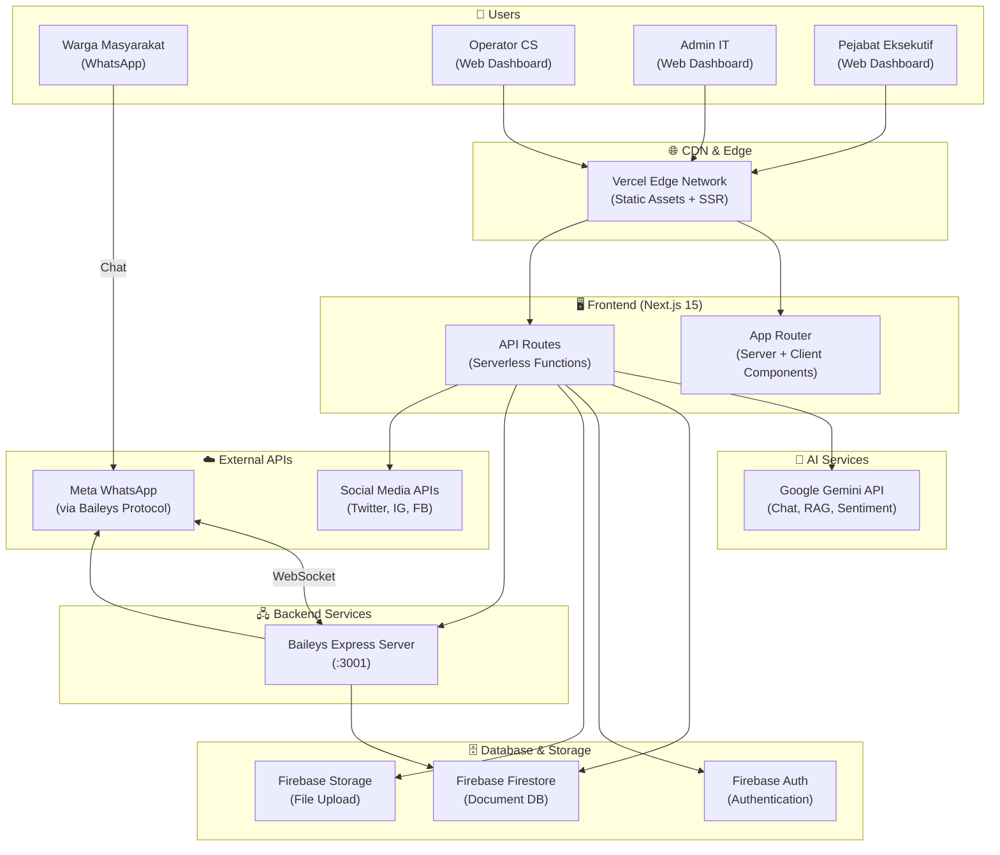
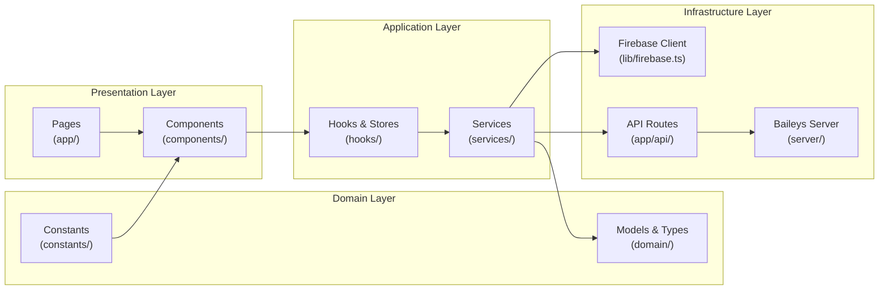
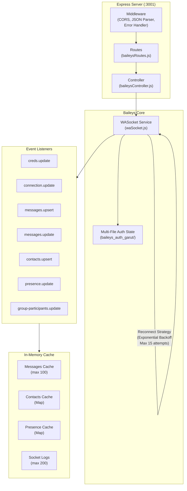
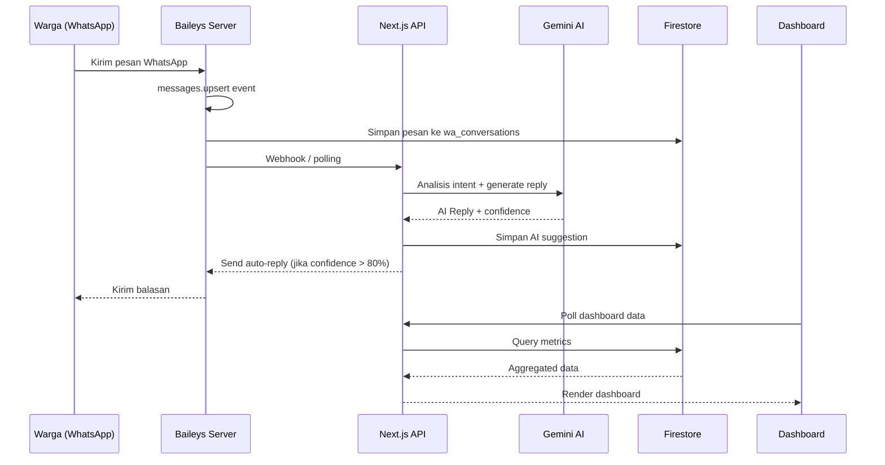
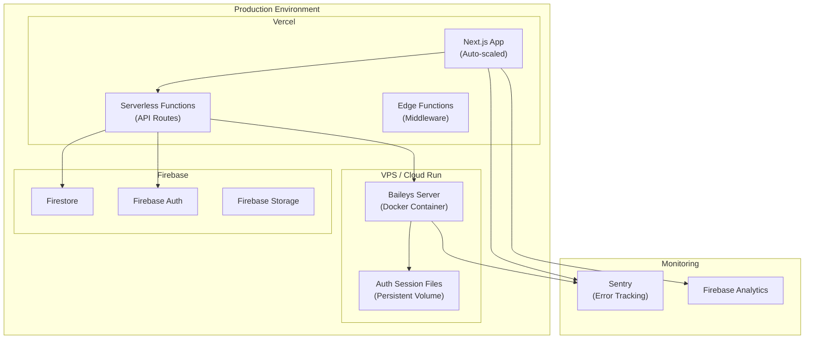
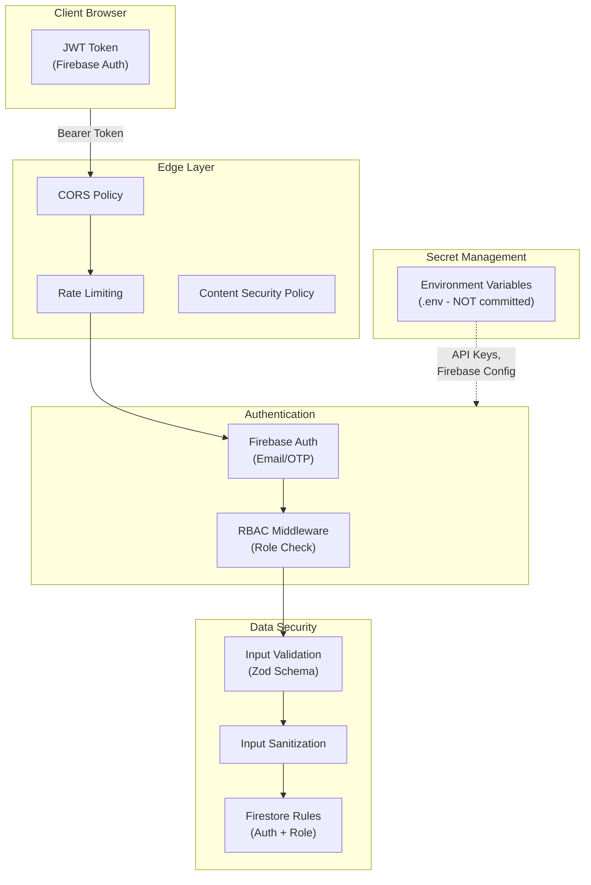

# 🏗️ System Architecture
## GPS-CC: Garut Public Service AI Command Center

---

## 1. High-Level Architecture

---

## 2. Application Layer Architecture

---

## 3. Baileys Server Internal Architecture

---

## 4. Data Flow Architecture

---

## 5. Deployment Architecture

---

## 6. Security Architecture

---

## 7. Technology Stack Summary

| Layer | Technology | Purpose |
|-------|-----------|---------|
| **Frontend** | Next.js 15 (App Router) | SSR, routing, API routes |
| **UI** | React 19 + Tailwind CSS 4 | Component rendering + styling |
| **State** | Zustand 5 | Client-side state management |
| **Charts** | Recharts 3 | Data visualization |
| **Maps** | Leaflet + React-Leaflet | GIS mapping |
| **Animation** | Motion 12 | UI animations |
| **Icons** | Lucide React | Icon system |
| **AI** | Google Gemini API | NLP, chatbot, sentiment |
| **Database** | Firebase Firestore | NoSQL document store |
| **Auth** | Firebase Authentication | User auth + JWT |
| **Storage** | Firebase Storage | File uploads |
| **WhatsApp** | Baileys (WebSocket) | WA Business API |
| **Backend WA** | Express 5 | REST API for Baileys |
| **Logging** | Pino | Structured logging |
| **QR Code** | qrcode.react | QR rendering |
