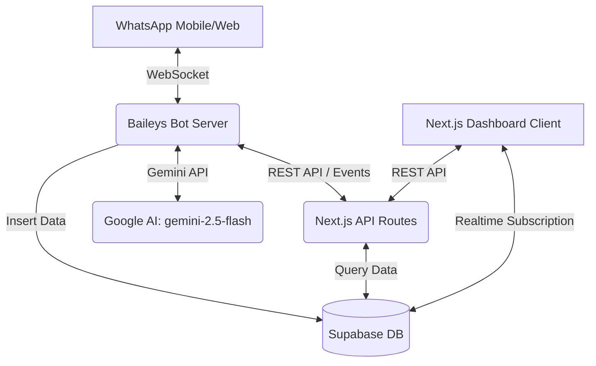

# 🏛️ System Architecture: GPS-CC

## 1. High-Level Architecture
Sistem ini menggunakan arsitektur hybrid di mana aplikasi Next.js bertindak sebagai UI Dashboard sekaligus penyedia API, sementara *Standalone Node.js Server* menggunakan Baileys menangani koneksi WebSocket WhatsApp yang persisten.

## 2. Directory Structure & Clean Architecture Layers

Proyek ini sangat ketat mematuhi batasan *Clean Architecture* seperti yang tertulis dalam aturan pengembangan (AGENTS.md):

- `domain/`: Interface dan Typescript Definition murni. **(Tanpa dependensi luar)**
- `services/`: Lapisan logika bisnis dan API client (contoh: `apiService.ts`).
- `hooks/`: Custom hooks React & Zustand store (contoh: `useWhatsApp.ts`).
- `components/`: Komponen presentasional React dengan Tailwind CSS v4 & Shadcn.
- `app/`: Next.js App Router (Halaman, Layout, dan rute API HTTP backend).
- `server/`: Jantung bot WhatsApp (Baileys standalone backend).
  - `server/core/WhatsAppClient.js`: Manajemen siklus hidup koneksi, auto-reconnect, & session purge.
  - `server/core/MessageHandler.js`: Logika penanganan pesan (Interactive Menu -> Keyword -> AI PURI).
  - `server/services/`: Modul integrasi pihak ketiga (Supabase, Gemini AI).

## 3. Hybrid Response Flow (Menu -> Keyword -> AI)
Sistem memiliki hierarki respon yang ketat untuk memastikan user mendapat jawaban terpandu sebelum diberikan ke AI:
1. Pesan masuk dievaluasi untuk **Menu Interaktif** (Pilihan list/button standar).
2. Jika tidak cocok, sistem mencari **Keyword Spesifik** dari database.
3. Jika masih tidak ada kecocokan, pesan dilempar ke **Gemini AI**, yang diformat dengan header identitas **PURI** secara otomatis.

## 4. Realtime Dashboard Flow
Untuk mengatasi masalah latensi atau *page reload flicker*:
1. Pesan dikirim oleh User.
2. `MessageHandler` di Baileys langsung menyimpan pesan masuk (dan balasannya) ke Supabase `wa_messages`.
3. Komponen `WhatsAppDashboard` di Next.js berlangganan ke *Supabase Channel*.
4. Event `INSERT` diterima klien, state React di-update, daftar pesan bertambah seketika tanpa perlu *polling HTTP GET*.

## 5. Stability Mechanism (24/7 Operation)
- **Auto-Reconnect**: Jika koneksi WebSocket terputus dari pihak WhatsApp, Baileys akan menyambung ulang dengan *exponential backoff*.
- **Session Purge (Error 440)**: Jika kode 440 (Conflict) terdeteksi, folder autentikasi (`./baileys_auth_garut`) dihapus bersih agar proses bisa berjalan dari awal dan tidak stuck dalam loop error.
- **Silent Fetch**: *Data-fetching* awal atau paginasi di Next.js dilakukan secara asinkron tanpa men-trigger `isLoading` penuh, agar layar chat tidak *flicker/reload* saat sedang digunakan.
