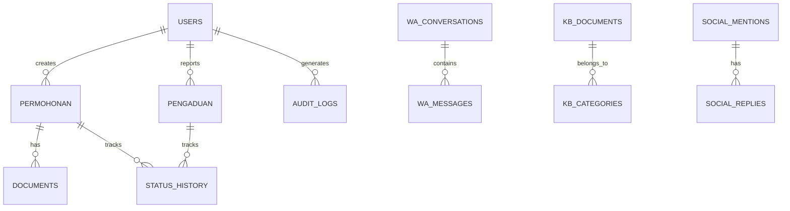

# 🗄️ Database Schema
## GPS-CC: Firebase Firestore Collections

---

## Overview

GPS-CC menggunakan **Firebase Firestore** sebagai database utama dengan struktur NoSQL document-oriented.



---

## Collections

### 1. `users` — Pengguna Sistem

```typescript
interface User {
  id: string;                    // Firebase Auth UID
  email: string;
  displayName: string;
  role: 'super_admin' | 'admin' | 'operator' | 'viewer';
  bidang?: string;               // Bidang di Dinas PUPR
  phoneNumber?: string;
  avatarUrl?: string;
  isActive: boolean;
  lastLoginAt: Timestamp;
  createdAt: Timestamp;
  updatedAt: Timestamp;
}
```

---

### 2. `permohonan` — Data Permohonan Layanan

```typescript
interface Permohonan {
  id: string;                    // Auto-generated
  nomorRegistrasi: string;       // Format: KRK-2024-0001
  jenisLayanan: 'KRK' | 'PKKPR' | 'PEIL' | 'IRIGASI' | 'RUMIJA' | 'SITEPLAN' | 'PBG' | 'SLF';
  
  // Data Pemohon
  pemohon: {
    nama: string;
    nik: string;
    telepon: string;
    email?: string;
    alamat: string;
    kecamatan: string;
    desa: string;
  };
  
  // Data Lokasi
  lokasi: {
    alamat: string;
    kecamatan: string;
    desa: string;
    koordinat?: {
      lat: number;
      lng: number;
    };
  };
  
  // Status & Workflow
  status: 'DIAJUKAN' | 'VERIFIKASI' | 'DIPROSES' | 'REVISI' | 'SELESAI' | 'DITOLAK';
  assignedTo?: string;           // User ID operator
  assignedBidang?: string;
  
  // SLA
  sla: {
    targetDays: number;          // Target penyelesaian (hari kerja)
    startDate: Timestamp;
    dueDate: Timestamp;
    completedDate?: Timestamp;
    isBreached: boolean;
  };
  
  // Metadata
  documents: string[];           // Array of document IDs (sub-collection)
  notes?: string;
  channel: 'web' | 'whatsapp' | 'walk_in';
  createdBy: string;             // User ID
  createdAt: Timestamp;
  updatedAt: Timestamp;
}
```

**Sub-collection: `permohonan/{id}/documents`**
```typescript
interface PermohonanDocument {
  id: string;
  name: string;
  type: 'KTP' | 'SURAT_TANAH' | 'SITEPLAN' | 'IMB_LAMA' | 'FOTO_LOKASI' | 'LAINNYA';
  fileUrl: string;               // Firebase Storage URL
  fileSize: number;              // bytes
  mimeType: string;
  uploadedBy: string;
  uploadedAt: Timestamp;
  status: 'UPLOADED' | 'VERIFIED' | 'REJECTED';
  rejectionReason?: string;
}
```

**Sub-collection: `permohonan/{id}/status_history`**
```typescript
interface StatusHistory {
  id: string;
  fromStatus: string;
  toStatus: string;
  changedBy: string;             // User ID
  notes?: string;
  timestamp: Timestamp;
}
```

---

### 3. `pengaduan` — Data Pengaduan Warga

```typescript
interface Pengaduan {
  id: string;
  nomorTiket: string;            // Format: ADU-2024-0001
  
  // Data Pelapor
  pelapor: {
    nama: string;
    telepon: string;
    email?: string;
    alamat?: string;
  };
  
  // Detail Pengaduan
  kategori: 'JALAN' | 'DRAINASE' | 'IRIGASI' | 'BANGUNAN' | 'TATA_RUANG' | 'PBG' | 'SLF' | 'LAINNYA';
  judul: string;
  deskripsi: string;
  prioritas: 'LOW' | 'MEDIUM' | 'HIGH' | 'CRITICAL';
  
  // Lokasi
  lokasi: {
    alamat: string;
    kecamatan: string;
    koordinat?: { lat: number; lng: number; };
  };
  
  // Media
  fotoUrls?: string[];           // Firebase Storage URLs
  
  // Workflow
  status: 'OPEN' | 'ASSIGNED' | 'IN_PROGRESS' | 'RESOLVED' | 'CLOSED' | 'REJECTED';
  assignedTo?: string;
  resolvedBy?: string;
  resolution?: string;
  
  // SLA
  sla: {
    targetDays: number;
    dueDate: Timestamp;
    isBreached: boolean;
  };
  
  // Sentiment
  sentiment?: 'POSITIVE' | 'NEUTRAL' | 'NEGATIVE';
  sentimentScore?: number;       // 0-1
  
  // Source
  channel: 'web' | 'whatsapp' | 'social_media' | 'walk_in';
  socialMediaRef?: string;       // Reference to social_mentions collection
  
  createdAt: Timestamp;
  updatedAt: Timestamp;
}
```

---

### 4. `wa_conversations` — Percakapan WhatsApp

```typescript
interface WAConversation {
  id: string;
  contactJid: string;            // WhatsApp JID
  contactName: string;
  contactNumber: string;
  
  lastMessage: string;
  lastMessageAt: Timestamp;
  unreadCount: number;
  
  status: 'ACTIVE' | 'RESOLVED' | 'BOT_HANDLING' | 'PENDING';
  category?: 'PBG' | 'SLF' | 'KRK' | 'PENGADUAN' | 'INFORMASI' | 'GENERAL';
  assignedOperator?: string;
  
  // AI
  aiSuggestedReply?: {
    text: string;
    confidence: number;
    source: string;
  };
  
  tags?: string[];
  notes?: string[];
  
  createdAt: Timestamp;
  updatedAt: Timestamp;
}
```

**Sub-collection: `wa_conversations/{id}/messages`**
```typescript
interface WAMessage {
  id: string;
  sender: 'USER' | 'BOT' | 'OPERATOR';
  senderName?: string;
  text: string;
  
  // Media
  attachments?: {
    type: 'IMAGE' | 'PDF' | 'DOC' | 'LOCATION';
    url: string;
    name?: string;
  }[];
  
  status: 'SENT' | 'DELIVERED' | 'READ';
  timestamp: Timestamp;
}
```

---

### 5. `social_mentions` — Social Media Mentions

```typescript
interface SocialMention {
  id: string;
  platform: 'TWITTER' | 'INSTAGRAM' | 'FACEBOOK' | 'TIKTOK' | 'YOUTUBE';
  author: string;
  authorHandle?: string;
  content: string;
  
  sentiment: 'POSITIVE' | 'NEUTRAL' | 'NEGATIVE';
  sentimentScore: number;
  topic: string;
  
  engagement: {
    likes: number;
    shares: number;
    comments: number;
  };
  
  isReplied: boolean;
  replyContent?: string;
  repliedBy?: string;
  repliedAt?: Timestamp;
  
  originalUrl?: string;
  capturedAt: Timestamp;
  createdAt: Timestamp;
}
```

---

### 6. `kb_documents` — Knowledge Base

```typescript
interface KBDocument {
  id: string;
  title: string;
  category: 'SOP' | 'PERBUP' | 'SK' | 'PANDUAN' | 'FAQ' | 'REGULASI';
  content: string;               // Full text (untuk RAG)
  summary?: string;
  
  fileUrl?: string;              // PDF original
  tags: string[];
  
  version: number;
  publishedBy: string;
  isActive: boolean;
  
  createdAt: Timestamp;
  updatedAt: Timestamp;
}
```

---

### 7. `settings` — Konfigurasi Sistem

```typescript
interface SystemSettings {
  id: string;                    // 'global' | 'whatsapp' | 'ai' | 'sla'
  
  // Global
  siteName?: string;
  siteDescription?: string;
  
  // SLA defaults per layanan
  slaDefaults?: Record<string, number>;  // { KRK: 5, PBG: 14, ... }
  
  // AI
  aiModel?: string;
  aiTemperature?: number;
  aiSystemPrompt?: string;
  
  // WhatsApp
  waGreetingMessage?: string;
  waAutoReplyEnabled?: boolean;
  
  updatedBy: string;
  updatedAt: Timestamp;
}
```

---

### 8. `audit_logs` — Jejak Audit

```typescript
interface AuditLog {
  id: string;
  userId: string;
  userName: string;
  action: 'CREATE' | 'UPDATE' | 'DELETE' | 'LOGIN' | 'LOGOUT' | 'EXPORT' | 'ASSIGN';
  resource: string;              // e.g., 'permohonan', 'pengaduan'
  resourceId?: string;
  details: string;
  ipAddress?: string;
  userAgent?: string;
  timestamp: Timestamp;
}
```

---

## Indexes (Composite)

| Collection | Fields | Order | Purpose |
|------------|--------|-------|---------|
| `permohonan` | `jenisLayanan`, `createdAt` | ASC, DESC | Filter per layanan + sort terbaru |
| `permohonan` | `status`, `sla.dueDate` | ASC, ASC | SLA monitoring breach |
| `permohonan` | `pemohon.kecamatan`, `status` | ASC, ASC | GIS per kecamatan |
| `pengaduan` | `kategori`, `status`, `createdAt` | ASC, ASC, DESC | Filter pengaduan |
| `pengaduan` | `prioritas`, `sla.isBreached` | ASC, ASC | Eskalasi prioritas |
| `social_mentions` | `platform`, `sentiment`, `capturedAt` | ASC, ASC, DESC | Social filter |
| `audit_logs` | `userId`, `timestamp` | ASC, DESC | User activity |
