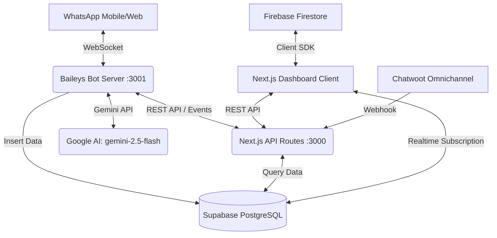
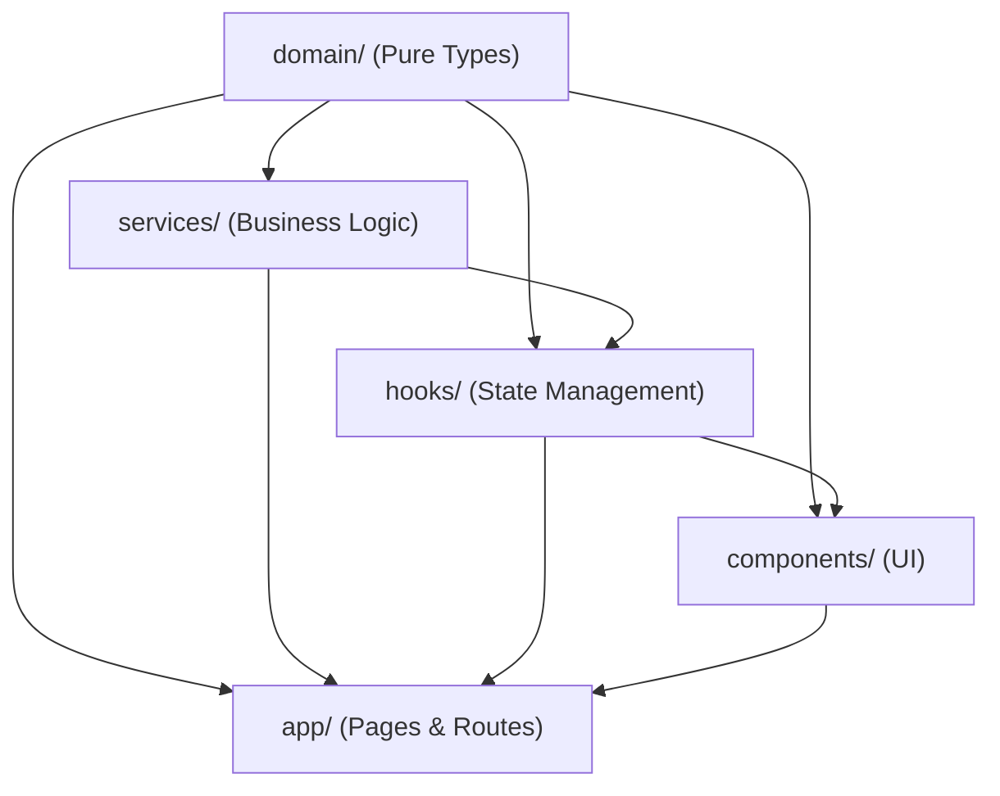
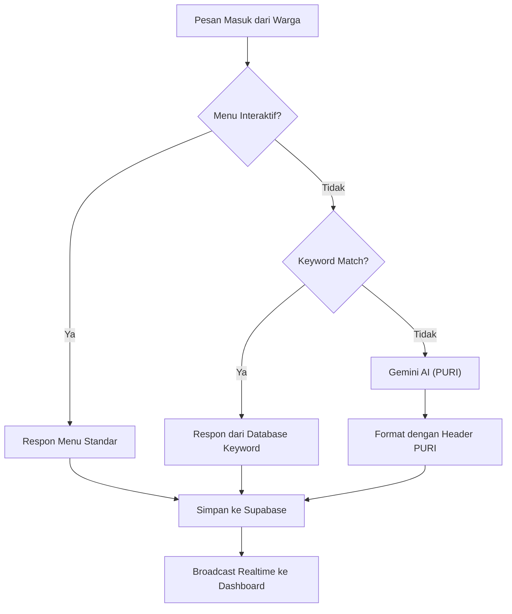
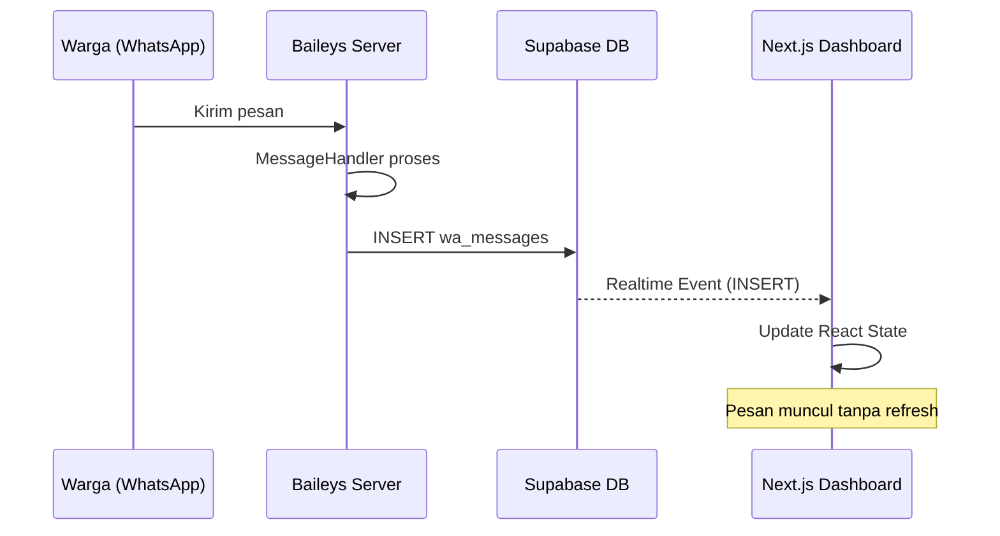
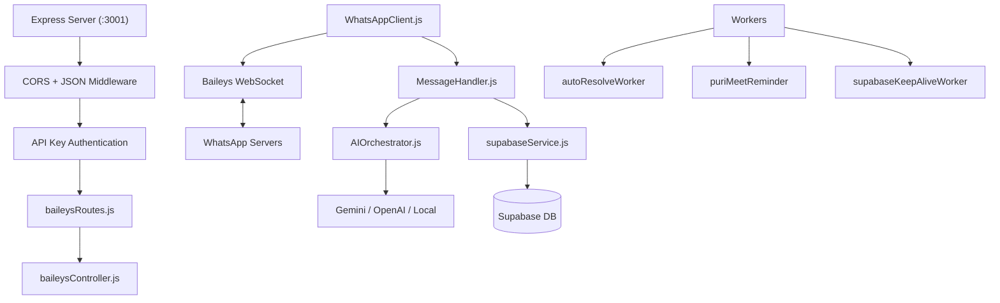
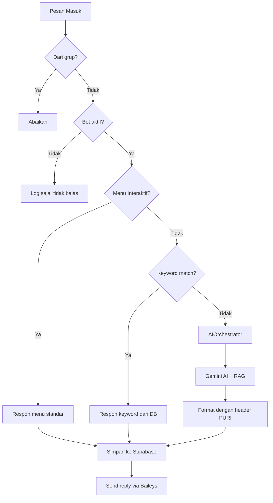
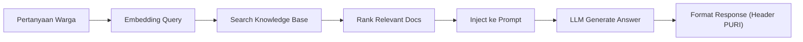
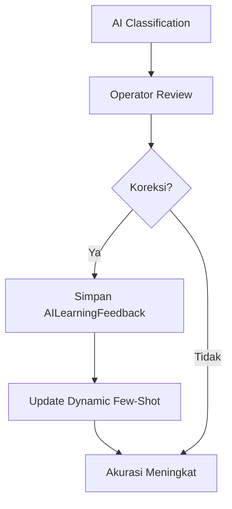
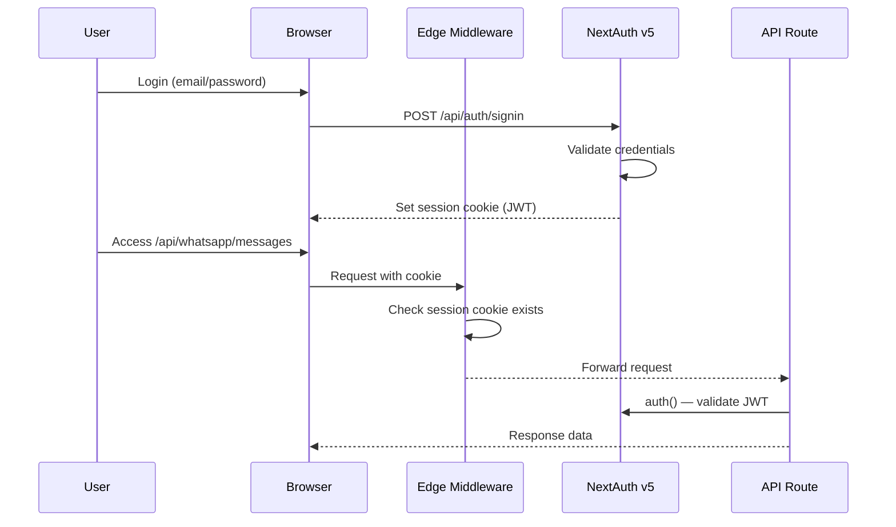

# 📖 DOKUMENTASI MENDALAM GPS-CC
## Garut Public Service AI Command Center
**Versi Dokumen:** 1.0 | **Terakhir Diperbarui:** 31 Agustus 2026 | **Penulis:** Tim Pengembang PUPR Garut

> Dokumen ini merupakan referensi teknis menyeluruh untuk seluruh aspek sistem GPS-CC — dari arsitektur hingga panduan deployment dan maintenance. Ditujukan untuk pengembang, DevOps, dan stakeholder teknis.

---

## Daftar Isi

1. [Executive Overview](#1-executive-overview)
2. [System Architecture Deep Dive](#2-system-architecture-deep-dive)
3. [Technology Stack Detail](#3-technology-stack-detail)
4. [Codebase Map](#4-codebase-map)
5. [Domain Layer Reference](#5-domain-layer-reference)
6. [Service Layer Reference](#6-service-layer-reference)
7. [Hooks & State Management](#7-hooks--state-management)
8. [Component Architecture](#8-component-architecture)
9. [API Routes Reference](#9-api-routes-reference)
10. [Baileys WhatsApp Server Deep Dive](#10-baileys-whatsapp-server-deep-dive)
11. [AI Systems](#11-ai-systems)
12. [Database Schema](#12-database-schema)
13. [Security Architecture](#13-security-architecture)
14. [Environment Configuration](#14-environment-configuration)
15. [Deployment Guide](#15-deployment-guide)
16. [Maintenance & Operations](#16-maintenance--operations)

---

## 1. Executive Overview

### 1.1 Apa itu GPS-CC?

GPS-CC (**Garut Public Service AI Command Center**) adalah platform *command center* digital berbasis AI untuk **Dinas Pekerjaan Umum dan Penataan Ruang (PUPR) Kabupaten Garut**. Platform ini merupakan ekosistem terpadu yang mengintegrasikan:

- 🖥️ **Executive Dashboard** — Monitoring real-time 8 jenis layanan publik
- 📱 **WhatsApp Command Center** — Bot AI PURI untuk pelayanan publik 24/7
- 🌐 **PSIC (PURI Social Intelligence Center)** — AI Omnichannel Social Media Monitoring
- 📊 **SPMS (Smart Public Service Performance Management)** — Sistem penilaian kinerja pelayanan
- 🗺️ **GIS Mapping** — Peta interaktif permohonan & pengaduan
- 🤖 **PURI AI** — Asisten kecerdasan buatan dengan 6-Tier Hierarchical Routing
- 📹 **PURI Meet** — Video conference terintegrasi untuk konsultasi publik

### 1.2 Identitas Bot: PURI

Bot AI dalam sistem ini beridentitas **PURI** — singkatan dari **Pelayanan Umum Responsif dan Informatif**. PURI dirancang untuk beroperasi secara mandiri 24/7 dan melayani warga Kabupaten Garut melalui berbagai kanal komunikasi.

### 1.3 Layanan yang Dikelola

| Kode | Nama Layanan | Deskripsi |
|------|-------------|-----------|
| KRK | Keterangan Rencana Kota | Informasi tata ruang & zonasi |
| PKKPR | Persetujuan Kesesuaian Kegiatan Pemanfaatan Ruang | Izin pemanfaatan ruang |
| PEIL | Peil Banjir | Rekomendasi teknis ketinggian banjir |
| IRIGASI | Rekomendasi Teknis Irigasi | Izin penggunaan saluran irigasi |
| RUMIJA | Ruang Milik Jalan | Izin pemanfaatan bahu jalan |
| SITEPLAN | Pengesahan Siteplan | Pengesahan rencana tapak |
| PBG | Persetujuan Bangunan Gedung | Izin mendirikan bangunan |
| SLF | Sertifikat Laik Fungsi | Sertifikasi kelayakan bangunan |

### 1.4 7 Bidang Dinas PUPR Kabupaten Garut

1. **SEKRETARIAT** — Informasi umum, administrasi, PPID
2. **PENATAAN_RUANG** — KRK, PKKPR, RTRW, RDTR, Zonasi, Siteplan
3. **BANGUNAN_GEDUNG** — PBG, SLF, pemeriksaan teknis gedung
4. **BINA_MARGA** — Jalan kabupaten, jembatan, trotoar, marka
5. **SDA** — Irigasi, drainase, sungai, banjir, embung
6. **JASA_KONSTRUKSI** — Sertifikasi, pembinaan, pengawasan jasa konstruksi
7. **AMPL** — Air minum, sanitasi, air limbah domestik

### 1.5 Target KPI

| Metrik | Target | Baseline |
|--------|--------|----------|
| SLA Compliance Rate | ≥ 97% | ~94.5% |
| Indeks Kepuasan Masyarakat (IKM) | ≥ 90/100 | ~86.4 |
| Rata-rata Waktu Penyelesaian | ≤ 3 hari | ~4.2 hari |
| First Response Time (WhatsApp) | ≤ 5 menit | Manual |
| AI Auto-Response Rate | ≥ 80% | 0% |
| Pengaduan Terselesaikan | ≥ 95% | ~85% |

---

## 2. System Architecture Deep Dive

### 2.1 Arsitektur Hybrid

GPS-CC menggunakan arsitektur **hybrid** dengan dua proses utama yang berjalan bersamaan:



**Komponen Utama:**

| Komponen | Port | Teknologi | Fungsi |
|----------|------|-----------|--------|
| **Next.js Frontend** | 3000 | Next.js 15 (App Router) | Dashboard UI + API proxy |
| **Baileys Server** | 3001 | Express.js 5 + Baileys | WhatsApp bot standalone |
| **Supabase** | Cloud | PostgreSQL + Realtime | Database utama (WhatsApp, PSIC, SPMS, PURI Meet) |
| **Firebase** | Cloud | Firestore + Auth | Database legacy (users, permohonan, pengaduan) |

### 2.2 Clean Architecture Layers

Proyek ini mengikuti **Clean Architecture** dengan pemisahan yang ketat:

```
gps-cc/
├── domain/          → Pure TypeScript interfaces & types (TANPA import library)
├── services/        → Business logic & API client layer
├── hooks/           → React hooks & Zustand stores (state management)
├── components/      → React UI components (presentational & container)
├── app/             → Next.js pages & API routes (routing layer)
├── lib/             → Shared utilities & third-party config
├── constants/       → Static values, enums, design tokens
└── server/          → Standalone Express backend (Baileys WhatsApp)
```

**Dependency Rule (Aturan Ketergantungan):**



- `domain/` → **TIDAK BOLEH** import dari layer manapun
- `services/` → Hanya import dari `domain/`
- `hooks/` → Import dari `domain/` dan `services/`
- `components/` → Import dari `hooks/`, `domain/`, `lib/`, `constants/`
- `app/` → Import dari semua layer

### 2.3 Hybrid Response Flow (Menu → Keyword → AI)

Sistem memiliki hierarki respon berjenjang:



### 2.4 Realtime Dashboard Flow



### 2.5 Stability Mechanisms (24/7 Operation)

| Mekanisme | Deskripsi |
|-----------|-----------|
| **Auto-Reconnect** | Exponential backoff saat WebSocket terputus |
| **Session Purge (Error 440)** | Hapus otomatis folder `baileys_auth_garut` saat conflict |
| **Silent Fetch** | Data fetching tanpa trigger `isLoading` penuh |
| **Supabase Keep-Alive** | Worker berkala untuk mencegah idle timeout |
| **Auto-Resolve Worker** | Otomatis resolve percakapan lama yang tidak aktif |

---

## 3. Technology Stack Detail

### 3.1 Frontend Stack

| Teknologi | Versi | Fungsi | Alasan Pemilihan |
|-----------|-------|--------|------------------|
| Next.js (App Router) | 15.4.x | Framework React fullstack | SSR, API Routes, file-based routing |
| React | 19.2.x | UI Library | Concurrent rendering, hooks |
| TypeScript | 5.9.x | Type safety | Strict mode, error prevention |
| Tailwind CSS | 4.1.x | Styling | Utility-first, dark mode |
| Zustand | 5.0.x | State Management | Lightweight, TypeScript native |
| Recharts | 3.10.x | Data visualization | React-native charts |
| Leaflet + React-Leaflet | 1.9.x / 5.0.x | GIS mapping | Open source maps |
| Motion (Framer Motion) | 12.23.x | Animations | Declarative animation API |
| Lucide React | 0.553.x | Icons | Consistent icon library |
| Shadcn/UI | 4.14.x | UI primitives | Composable, accessible components |

### 3.2 Backend Stack

| Teknologi | Versi | Fungsi |
|-----------|-------|--------|
| Express.js | 5.2.x | HTTP server untuk Baileys |
| @whiskeysockets/baileys | 7.0.x | WhatsApp Web API (no browser) |
| @google/genai | 2.4.x | Google Gemini AI SDK |
| Pino | 10.3.x | Structured JSON logging |
| QRCode | 1.5.x | QR code generation |

### 3.3 Database & Storage

| Teknologi | Fungsi | Data yang Disimpan |
|-----------|--------|-------------------|
| **Supabase (PostgreSQL)** | Database utama + Realtime | WhatsApp messages, PSIC, SPMS, PURI Meet |
| **Firebase Firestore** | Database legacy | Users, permohonan, pengaduan, settings |
| **Firebase Auth** | Authentication (legacy) | User credentials |
| **Supabase Storage** | File storage | Media WhatsApp, dokumen |

### 3.4 Authentication

| Teknologi | Versi | Fungsi |
|-----------|-------|--------|
| NextAuth.js v5 | 5.0.0-beta.32 | Session management, JWT |
| Keycloak Provider | - | SSO enterprise (konfigurasi placeholder) |
| Credentials Provider | - | Login email/password |

### 3.5 Deployment Targets

| Platform | Konfigurasi | File |
|----------|-------------|------|
| Railway | Container deployment | `railway.json`, `nixpacks.toml` |
| Render | Blueprint spec | `render.yaml` |
| Vercel | Next.js optimized | (default Next.js) |
| Local Windows | Batch launcher | `start-all.bat`, `start-dev.bat` |

---

## 4. Codebase Map

### 4.1 Root Directory

```
gps-cc/                          # Project root
├── .agents/                     # Agent rules (AGENTS.md)
├── .env                         # Environment variables (3KB) — TIDAK di-commit
├── .env.example                 # Template environment variables
├── .github/                     # GitHub Actions workflows
│   └── workflows/
│       └── supabase-keepalive.yml  # Cron job keep-alive Supabase
├── app/                         # Next.js App Router (pages + API)
├── assets/                      # Static assets
├── auth.ts                      # NextAuth v5 configuration (Keycloak + Credentials)
├── baileys_auth_garut/          # WhatsApp session storage (auto-generated)
├── components/                  # React components
├── constants/                   # Static values & theme tokens
├── docs/                        # Project documentation (17 files)
├── domain/                      # Pure TypeScript interfaces (10 files)
├── firestore.rules              # Firebase Firestore security rules
├── hooks/                       # React hooks & Zustand stores (7 files)
├── lib/                         # Shared utilities (4 files)
├── middleware.ts                 # Next.js Edge middleware (API auth)
├── next.config.ts               # Next.js configuration
├── nixpacks.toml                # Nixpacks build config (Railway)
├── package.json                 # Dependencies & scripts
├── patch.js                     # Runtime patches for Next.js
├── public/                      # Static public files
├── railway.json                 # Railway deployment config
├── render.yaml                  # Render deployment config
├── scripts/                     # Utility scripts (8 files)
├── server/                      # Baileys WhatsApp standalone server
├── services/                    # Business logic layer (14 files)
├── start-all.bat                # Windows production launcher
├── start-dev.bat                # Windows development launcher
├── supabase_spms_settings.sql   # SPMS database setup
└── tsconfig.json                # TypeScript configuration
```

### 4.2 `app/` — Next.js Pages & API Routes

```
app/
├── globals.css                  # Global CSS + Tailwind v4 + design tokens
├── layout.tsx                   # Root layout (Inter font, dark mode, ClientLayout)
├── page.tsx                     # Executive Dashboard (29KB — halaman utama)
├── not-found.tsx                # 404 page
│
├── ai-cs/                       # AI Customer Service page
├── ai-dashboard/                # AI Analytics Dashboard
├── analisis/                    # Data Analysis page
├── gis/                         # GIS Map page (Leaflet)
├── kb/                          # Knowledge Base page
├── login/                       # Authentication page
├── monitoring/                  # System Monitoring page
├── pegawai/                     # Employee Management page
├── pelayanan/                   # Service Management (CRUD permohonan)
├── pengaduan/                   # Complaint Management page
├── puri-meet/                   # PURI Meet Video Conference
├── search/                      # Global Search page
├── sla/                         # SLA Monitoring page
├── social/                      # PSIC Social Intelligence Center
├── spms/                        # SPMS Performance Dashboard
├── wa-media/                    # WhatsApp Media Viewer (private signed URLs)
├── whatsapp/                    # WhatsApp Command Center
│
└── api/                         # Next.js API Routes
    ├── ai/                      # AI settings API
    │   └── settings/            # GET/POST AI configuration
    ├── ai-orchestrator/         # PURI AI Orchestrator API
    ├── auth/                    # NextAuth catch-all route
    │   └── [...nextauth]/       # NextAuth v5 handlers
    ├── gemini/                  # Gemini AI direct API
    ├── kb/                      # Knowledge Base API
    ├── psic/                    # PSIC Omnichannel API
    │   ├── chatwoot/            # Chatwoot webhook receiver
    │   ├── omnichannel/         # Omnichannel unified API
    │   └── webhook/             # Generic webhook receiver
    ├── social-listening/        # Social media listening API
    ├── supabase/                # Supabase helper API
    │   └── keepalive/           # Keep-alive endpoint
    ├── whatsapp/                # WhatsApp management API
    │   ├── analytics/           # Chat analytics
    │   ├── baileys/             # Baileys proxy (status, QR, pair)
    │   ├── bot-flows/           # Bot conversation flows CRUD
    │   ├── bot-keywords/        # Bot keyword triggers CRUD
    │   ├── bot-settings/        # Bot configuration API
    │   ├── media-url/           # Private media URL signer
    │   ├── messages/            # Message fetch & send
    │   ├── operators/           # Operator management
    │   ├── spreadsheets/        # Spreadsheet export/import
    │   └── templates/           # Quick response templates
    └── whisper/                 # Speech-to-text (Whisper) API
```

### 4.3 `server/` — Baileys WhatsApp Server

```
server/
├── baileys-server.js            # Express entry point (2.7KB)
├── config/
│   └── baileys.js               # Port, session path, CORS config
├── controllers/
│   └── baileysController.js     # HTTP endpoint handlers
├── core/
│   ├── AIOrchestrator.js        # Multi-model AI routing (27.5KB)
│   ├── CallHandler.js           # Voice call handling (2.1KB)
│   ├── MessageHandler.js        # Message processing pipeline (20.8KB)
│   └── WhatsAppClient.js        # Connection lifecycle (16.6KB)
├── data/
│   └── (runtime SQLite DB)      # Local cache database
├── routes/
│   └── baileysRoutes.js         # Express route definitions
├── services/
│   ├── ai/                      # AI-specific services
│   ├── aiSettingsService.js     # AI settings management (7.6KB)
│   ├── cacheService.js          # Semantic + exact cache (10KB)
│   ├── firestoreService.js      # Firestore integration (5.7KB)
│   ├── localDbService.js        # SQLite local DB (4.5KB)
│   ├── puriPromptEngine.js      # Dynamic prompt construction (26.5KB)
│   ├── ragService.js            # RAG pipeline (7.9KB)
│   ├── spreadsheetService.js    # Spreadsheet processing (14.8KB)
│   └── supabaseService.js       # Supabase CRUD operations (17.6KB)
└── workers/
    ├── autoResolveWorker.js     # Auto-resolve stale conversations (4.2KB)
    ├── puriMeetReminder.js      # WhatsApp meeting reminders (4.7KB)
    └── supabaseKeepAliveWorker.js # Supabase idle prevention (3.1KB)
```

### 4.4 `domain/` — Pure TypeScript Types

```
domain/
├── models.ts               # Core: DashboardMetrics, LayananKinerja, User, UserRole
├── aiRouting.ts             # PURI 6-Tier: BidangPUPR, AIPuriIntent, TicketPriority, SmartLabelPUPR, HierarchicalRoutingDecision, AILearningFeedback
├── aiOrchestrator.ts        # Multi-model: AIModelProvider, AITaskCategory, AIOrchestratorRequest/Response, AICacheEntry
├── whatsapp.ts              # WhatsApp: ConnectionStatus, Message, Conversation, OperatorStatus, BotLog
├── psic.ts                  # PSIC Omnichannel: PSICConversation, PSICMessage, PSICIssue, PSICReputationIndex
├── puriMeet.ts              # PURI Meet: Meeting, MeetingParticipant, MeetingStats, JitsiConfig
├── puriMeetChat.ts          # PURI Meet Chat messages
├── puriMeetFiles.ts         # PURI Meet file sharing
├── puriMeetTranscription.ts # PURI Meet transcription
└── spms.ts                  # SPMS: SPMSMetrics, SmartServiceScore, BidangPerformance, OperatorPerformance, AIPerformance, SurveyResponse, EarlyWarning
```

### 4.5 `services/` — Business Logic

```
services/
├── apiService.ts                # Dashboard data fetching (4.9KB)
├── authService.ts               # Firebase auth operations (4.6KB)
├── baileysService.ts            # Baileys HTTP client proxy (5.4KB)
├── chatwootService.ts           # Chatwoot API integration (16.7KB)
├── psicService.ts               # PSIC omnichannel logic (16.3KB)
├── puriMeetService.ts           # PURI Meet CRUD operations (21.2KB)
├── puriMeetChatService.ts       # Meeting chat service (2.7KB)
├── puriMeetFileService.ts       # Meeting file upload/download (3.6KB)
├── puriMeetTranscriptionService.ts # Transcription service (0.7KB)
├── ragService.ts                # RAG pipeline (client-side) (7.9KB)
├── spmsService.ts               # SPMS data service (16.2KB)
├── spmsSurveyService.ts         # SPMS survey management (7.7KB)
├── trendForecastService.ts      # Trend analysis & forecasting (5.3KB)
└── whatsappService.ts           # WhatsApp dashboard service (28.3KB)
```

### 4.6 `hooks/` — State Management

```
hooks/
├── use-mobile.ts             # Mobile responsive detection
├── useAuth.ts                # Authentication state (NextAuth)
├── useDashboard.ts           # Executive dashboard data
├── usePuriMeet.ts            # PURI Meet management store
├── useSPMS.ts                # SPMS performance data store
├── useSidebar.ts             # Sidebar toggle state
└── useWhatsApp.ts            # WhatsApp command center store (12.4KB)
```

### 4.7 `components/` — React UI Components

```
components/
├── auth/                    # Authentication components
├── dashboard/               # Executive Dashboard
│   ├── AIAssistantWidget.tsx   # Floating AI assistant (8KB)
│   └── MetricCard.tsx          # Service metric card (4.4KB)
├── layout/                  # App layout
│   ├── ClientLayout.tsx        # Client wrapper with auth (1.8KB)
│   ├── Sidebar.tsx             # Navigation sidebar (8.2KB)
│   └── Topbar.tsx              # Top navigation bar (9.4KB)
├── puri-meet/               # PURI Meet (11 components)
│   ├── ActiveMeetingBanner.tsx
│   ├── CreateMeetingModal.tsx
│   ├── MeetDashboard.tsx
│   ├── MeetingCalendar.tsx
│   ├── MeetingCard.tsx
│   ├── MeetingChat.tsx
│   ├── MeetingFileShare.tsx
│   ├── MeetingParticipants.tsx
│   ├── MeetingRoom.tsx         # Jitsi integration
│   ├── MeetingStats.tsx
│   └── MeetingTranscription.tsx
├── social/                  # PSIC Social Intelligence (10 components)
│   ├── AIAssistant.tsx
│   ├── ConversationView.tsx
│   ├── ExecutiveBriefingModal.tsx
│   ├── NativeGatewayModal.tsx
│   ├── RAGSearchModal.tsx
│   ├── SocialAnalytics.tsx
│   ├── SocialKPI.tsx
│   ├── SocialListeningFeed.tsx
│   ├── TrendForecastModal.tsx
│   └── UnifiedInbox.tsx
├── spms/                    # SPMS Performance (18 components)
│   ├── AIPerformanceCard.tsx
│   ├── AIRecommendationsPanel.tsx
│   ├── AITicker.tsx
│   ├── BidangPerformanceTable.tsx
│   ├── DashboardFilters.tsx
│   ├── EarlyWarningTicker.tsx
│   ├── KPIOverviewGrid.tsx
│   ├── NPSScoreCard.tsx
│   ├── OperatorLeaderboard.tsx
│   ├── PerformanceHeatmap.tsx
│   ├── SKMTable.tsx            # Survei Kepuasan Masyarakat (16.3KB)
│   ├── SLAComplianceChart.tsx
│   ├── SPMSLayout.tsx
│   ├── SentimentGauge.tsx
│   ├── SmartServiceScoreCard.tsx
│   ├── SurveyOverview.tsx
│   ├── SurveyPublicForm.tsx    # Public survey form (18.4KB)
│   └── TrendLineChart.tsx
├── ui/                      # Shadcn/Base UI primitives (8 components)
│   ├── badge.tsx
│   ├── button.tsx
│   ├── card.tsx
│   ├── input.tsx
│   ├── progress.tsx
│   ├── scroll-area.tsx
│   ├── sheet.tsx
│   └── tabs.tsx
└── whatsapp/                # WhatsApp Center (7 components)
    ├── PrivateMediaUrl.tsx
    ├── WhatsAppBotSettingsModal.tsx  # Bot settings (60.9KB)
    ├── WhatsAppDashboard.tsx        # Main WA dashboard (89.5KB)
    ├── WhatsAppFrontLogin.tsx       # QR/Pair login (23.4KB)
    ├── WhatsAppLogViewer.tsx        # Bot activity logs (20.8KB)
    ├── WhatsAppQrModal.tsx          # QR code modal (17.8KB)
    └── WhatsAppRightQrPanel.tsx     # Right panel QR display (14.8KB)
```

---

## 5. Domain Layer Reference

Layer `domain/` berisi **pure TypeScript interfaces dan types** tanpa dependensi ke library eksternal manapun. Ini adalah kontrak data yang digunakan oleh seluruh layer di atas.

### 5.1 Core Models (`domain/models.ts`)

```typescript
// Metrik utama dashboard eksekutif
interface DashboardMetrics {
  totalPermohonan: number;    // Total seluruh permohonan
  slaKepatuhan: number;       // Persentase kepatuhan SLA
  hariIni: number;            // Permohonan hari ini
  bulanIni: number;           // Permohonan bulan ini
  tahunIni: number;           // Permohonan tahun ini
  persentasePenyelesaian: number;
  ikm: number;                // Indeks Kepuasan Masyarakat (0-100)
  totalPengaduan: number;
  aiActivity: number;         // Jumlah aktivitas AI
}

// Kinerja per jenis layanan (8 layanan)
interface LayananKinerja {
  id: string;
  nama: string;               // e.g. "KRK", "PBG"
  total: number;
  selesai: number;
  proses: number;
  sla: number;                // Persentase SLA
}

// Role-based access control
type UserRole = 'super_admin' | 'admin' | 'operator' | 'viewer';

interface User {
  id: string;                  // Firebase Auth UID
  email: string;
  displayName: string;
  role: UserRole;
  bidang?: string;             // Bidang PUPR
  isActive: boolean;
}
```

### 5.2 AI Routing (`domain/aiRouting.ts`)

Definisi tipe untuk **6-Tier Hierarchical AI Routing Engine**:

```typescript
// 7 Bidang Utama Dinas PUPR
type BidangPUPR = 'SEKRETARIAT' | 'PENATAAN_RUANG' | 'BANGUNAN_GEDUNG'
                | 'BINA_MARGA' | 'SDA' | 'JASA_KONSTRUKSI' | 'AMPL';

// 10 Klasifikasi Intent
type AIPuriIntent = 'INFORMASI' | 'PERSYARATAN' | 'STATUS_PERMOHONAN'
                  | 'PENGADUAN' | 'KONSULTASI' | 'PERMOHONAN_BARU'
                  | 'PERMOHONAN_DOKUMEN' | 'SARAN' | 'KRITIK' | 'APRESIASI';

// 4 Level Prioritas
type TicketPriority = 'RENDAH' | 'NORMAL' | 'TINGGI' | 'KRITIS';

// 15 Smart Label Layanan
type SmartLabelPUPR = 'PBG' | 'SLF' | 'KRK' | 'PKKPR' | 'Siteplan'
                    | 'Jalan' | 'Jembatan' | 'Drainase' | 'Irigasi'
                    | 'SPAM' | 'Sanitasi' | 'Jasa Konstruksi'
                    | 'Administrasi' | 'Pengaduan' | 'Informasi';

// Keputusan routing lengkap (6-Tier)
interface HierarchicalRoutingDecision {
  ticketId: string;
  intent: AIPuriIntent;
  primaryBidang: BidangPUPR;
  secondaryBidang?: BidangPUPR[];     // Multi-bidang
  prioritas: TicketPriority;
  assignedOperatorId?: string;
  slaDuration: string;                 // "1 Hari", "< 2 Jam"
  confidenceScore: number;             // 0-100
  smartLabels: SmartLabelPUPR[];
  requiresCollab: boolean;             // Multi-bidang collaboration
  isEmergency: boolean;                // Pengaduan darurat
  status: 'AUTO_ASSIGNED' | 'SUPERVISOR_VALIDATION' | 'ESCALATED';
  draftResponse?: { text: string; knowledgeBaseSource?: string };
}

// Umpan balik koreksi operator → AI belajar
interface AILearningFeedback {
  originalAiDecision: HierarchicalRoutingDecision;
  operatorCorrection: {
    correctedBidang?: BidangPUPR[];
    correctedIntent?: AIPuriIntent;
    correctedPriority?: TicketPriority;
  };
}
```

### 5.3 AI Orchestrator (`domain/aiOrchestrator.ts`)

Definisi tipe untuk **Multi-Model AI Orchestration**:

```typescript
type AIModelProvider = 'OPENAI' | 'GEMINI' | 'CLAUDE' | 'KIMI' | 'LOCAL';

type AITaskCategory = 'CHAT_GENERAL' | 'DOCUMENT_PDF' | 'VISION_IMAGE'
                    | 'CODING_TECHNICAL' | 'REGULATION_LAW' | 'SUMMARY'
                    | 'CRITICAL_EMERGENCY';

interface AIOrchestratorResponse {
  text: string;
  providerUsed: AIModelProvider;
  isFromCache: boolean;
  confidenceScore: number;
  fallbackHistory: AIModelProvider[];    // Chain fallback yang terjadi
  routingDecision: HierarchicalRoutingDecision;
  executionTimeMs: number;
}
```

### 5.4 WhatsApp (`domain/whatsapp.ts`)

```typescript
interface WhatsAppConnectionStatus {
  status: 'disconnected' | 'connecting' | 'connected' | 'qr_ready' | 'pairing_ready';
  qrCodeUrl?: string;
  pairingCode?: string;
  phoneNumber?: string;
  pingMs?: number;
}

interface WhatsAppMessage {
  id: string;
  sender: 'user' | 'bot' | 'operator';
  text: string;
  timestamp: Date;
  type?: 'text' | 'image' | 'document' | 'video' | 'audio' | 'location';
  metadata?: { fileName?: string; mimetype?: string; fileUrl?: string };
}

interface WhatsAppConversation {
  id: string;
  contactName: string;
  contactNumber: string;
  messages: WhatsAppMessage[];
  status: 'active' | 'resolved' | 'bot_handling' | 'pending';
  // PURI 6-Tier Fields:
  bidang?: string | string[];
  intent?: string;
  prioritas?: 'RENDAH' | 'NORMAL' | 'TINGGI' | 'KRITIS';
  sla?: string;
  confidenceScore?: number;
  isEmergency?: boolean;
  smartLabels?: string[];
}
```

### 5.5 PSIC (`domain/psic.ts`)

```typescript
type PSICChannelType = 'whatsapp' | 'facebook' | 'instagram' | 'threads'
                     | 'twitter' | 'youtube' | 'tiktok' | 'telegram'
                     | 'google_business' | 'website' | 'portal_pengaduan' | 'email';

type PSICSentiment = 'POSITIF' | 'NETRAL' | 'NEGATIF' | 'SANGAT_NEGATIF' | 'URGENT';
type PSICEmotion = 'MARAH' | 'SENANG' | 'KECEWA' | 'BINGUNG' | 'MENDESAK' | 'TERIMA_KASIH';

interface PSICConversation {
  channelType: PSICChannelType;
  bidang?: BidangPUPR;
  intent?: AIPuriIntent;
  sentiment: PSICSentiment;
  emotion?: PSICEmotion;
  status: PSICResolutionStatus;
  isSlaBreached: boolean;
  isPotentialFakeNews?: boolean;
}

// Deteksi isu publik & krisis
interface PSICIssue {
  totalMentions: number;
  isCrisisAlert: boolean;     // ≥ 200 posting dalam 30 menit
  affectedKecamatan?: string[];
  status: 'MONITORING' | 'INVESTIGATING' | 'ESCALATED_KADIS' | 'RESOLVED';
}

// Indeks reputasi digital (0-100)
interface PSICReputationIndex {
  score: number;
  positivePercentage: number;
  slaComplianceRate: number;
}
```

### 5.6 SPMS (`domain/spms.ts`)

Mendefinisikan **10 KPI utama** dan **Smart Service Score (SSS)**:

```typescript
interface SPMSMetrics {
  ikm: number;                    // KPI 1: Indeks Kepuasan (0-100)
  slaCompliance: number;          // KPI 2: SLA Rate (%)
  firstResponseTime: number;      // KPI 3: Response time (menit)
  resolutionTime: number;         // KPI 4: Resolution time (jam)
  aiResponseRate: number;         // KPI 5: AI auto-response (%)
  humanInterventionRate: number;  // KPI 6: Manual intervention (%)
  knowledgeAccuracy: number;      // KPI 7: KB accuracy (%)
  sentimentPositif: number;       // KPI 8: Sentiment index
  nps: number;                    // KPI 9: Net Promoter Score (-100 to 100)
  complaintResolutionRate: number; // KPI 10: Complaint resolution (%)
}

interface SmartServiceScore {
  totalScore: number;             // 0-100
  grade: 'A' | 'B' | 'C' | 'D' | 'E';
  components: SSSComponent[];     // Komponen dengan bobot
}

interface EarlyWarning {
  type: 'SLA_BREACH' | 'SENTIMENT_NEGATIVE' | 'COMPLAINT_SURGE' | 'OPERATOR_OVERLOAD' | 'SATISFACTION_DROP';
  level: 'INFO' | 'WARNING' | 'CRITICAL';
}
```

### 5.7 PURI Meet (`domain/puriMeet.ts`)

```typescript
type MeetingType = 'KONSULTASI_PBG' | 'KONSULTASI_SLF' | 'KONSULTASI_KRK'
                 | 'PEMBAHASAN_SITEPLAN' | 'RAPAT_INTERNAL' | 'RAPAT_KOORDINASI'
                 | 'PEMBINAAN_JASA_KONSTRUKSI' | 'PENDAMPINGAN_TEKNIS' | ... ;

interface Meeting {
  id: string;
  title: string;
  type: MeetingType;
  status: 'SCHEDULED' | 'LIVE' | 'COMPLETED' | 'CANCELLED';
  priority: 'NORMAL' | 'PENTING' | 'MENDESAK';
  roomId: string;               // Jitsi room name
  bidang: BidangPURIMeet;
  scheduledAt: string;
  agenda: string[];
}
```

---

## 6. Service Layer Reference

Layer `services/` berisi logika bisnis dan API client yang menjembatani antara domain types dan UI. Semua service mengikuti pola async/await dengan error handling.

### 6.1 `whatsappService.ts` (28.3KB) — Terbesar

**Fungsi:** Mengelola seluruh interaksi WhatsApp dari sisi dashboard Next.js.

| Fungsi | Deskripsi |
|--------|-----------|
| `fetchConversations()` | Ambil daftar percakapan dari Supabase realtime |
| `fetchMessages(conversationId)` | Ambil riwayat pesan per kontak |
| `sendMessage(phone, message)` | Kirim pesan via Baileys proxy API |
| `fetchConnectionStatus()` | Cek status koneksi bot |
| `subscribeToRealtime()` | Berlangganan Supabase Realtime channel |
| `updateConversationStatus()` | Update status percakapan (active/resolved) |
| `fetchBotLogs()` | Ambil log aktivitas bot |
| `fetchAnalytics()` | Ambil statistik WhatsApp |

### 6.2 `puriMeetService.ts` (21.2KB)

**Fungsi:** CRUD dan lifecycle management untuk PURI Meet sessions.

| Fungsi | Deskripsi |
|--------|-----------|
| `createMeeting(input)` | Buat meeting baru + generate room ID |
| `fetchMeetings(filter)` | Ambil daftar meeting dengan filter |
| `startMeeting(id)` | Ubah status ke LIVE |
| `endMeeting(id)` | Ubah status ke COMPLETED + hitung durasi |
| `addParticipant(meetingId, participant)` | Tambah peserta |
| `fetchStats()` | Ambil statistik meeting |

### 6.3 `spmsService.ts` (16.2KB)

**Fungsi:** Data fetching dan kalkulasi KPI untuk SPMS dashboard.

| Fungsi | Deskripsi |
|--------|-----------|
| `fetchMetrics(period, bidang)` | Ambil 10 KPI utama |
| `calculateSSS()` | Hitung Smart Service Score komposit |
| `fetchBidangPerformance()` | Kinerja per bidang PUPR |
| `fetchOperatorPerformance()` | Leaderboard operator |
| `fetchEarlyWarnings()` | Peringatan dini |
| `fetchAIRecommendations()` | Rekomendasi AI |
| `fetchTrendData()` | Data tren bulanan |

### 6.4 `psicService.ts` (16.3KB)

**Fungsi:** PSIC omnichannel social intelligence operations.

| Fungsi | Deskripsi |
|--------|-----------|
| `fetchConversations(filter)` | Ambil percakapan dari semua kanal |
| `classifyMessage(content)` | 6-Tier AI classification |
| `fetchIssues()` | Ambil isu publik yang terdeteksi |
| `fetchReputationIndex()` | Skor reputasi digital |
| `sendReply(conversationId, message)` | Balas via platform asal |

### 6.5 `chatwootService.ts` (16.7KB)

**Fungsi:** Integrasi dengan Chatwoot omnichannel helpdesk.

| Fungsi | Deskripsi |
|--------|-----------|
| `processWebhook(payload)` | Proses incoming Chatwoot webhook |
| `addLabels(conversationId, labels)` | Pasang tag otomatis |
| `addPrivateNote(conversationId, note)` | Kirim catatan internal |
| `sendAutoReply(conversationId, message)` | Kirim balasan otomatis |

### 6.6 Service Lainnya

| Service | Size | Fungsi Utama |
|---------|------|-------------|
| `ragService.ts` | 7.9KB | RAG pipeline — pencarian Knowledge Base + embedding |
| `trendForecastService.ts` | 5.3KB | Analisis tren & prediksi time-series |
| `baileysService.ts` | 5.4KB | HTTP proxy ke Baileys standalone server |
| `authService.ts` | 4.6KB | Firebase Auth operations (login, register, role check) |
| `apiService.ts` | 4.9KB | Dashboard data aggregation |
| `spmsSurveyService.ts` | 7.7KB | Manajemen survei kepuasan masyarakat |
| `puriMeetChatService.ts` | 2.7KB | Chat dalam meeting room |
| `puriMeetFileService.ts` | 3.6KB | Upload/download file meeting |

---

## 7. Hooks & State Management

GPS-CC menggunakan **Zustand** untuk global state management (bukan Context API). Setiap store didefinisikan di `hooks/` dengan prefix `use`.

### 7.1 `useWhatsApp.ts` (12.4KB)

Store terbesar — mengelola seluruh state WhatsApp Command Center.

```typescript
// State yang dikelola:
interface WhatsAppState {
  connectionStatus: WhatsAppConnectionStatus;
  conversations: WhatsAppConversation[];
  selectedConversation: WhatsAppConversation | null;
  botLogs: WhatsAppBotLog[];
  operators: OperatorStatus[];
  isLoading: boolean;
  error: string | null;

  // Actions:
  fetchStatus: () => Promise<void>;
  fetchConversations: () => Promise<void>;
  selectConversation: (id: string) => void;
  sendMessage: (phone: string, text: string) => Promise<void>;
  subscribeRealtime: () => () => void;  // returns unsubscribe
}
```

### 7.2 `usePuriMeet.ts` (9.5KB)

Store untuk PURI Meet video conferencing.

```typescript
interface PuriMeetState {
  meetings: Meeting[];
  activeMeeting: Meeting | null;
  stats: MeetingStats | null;
  filters: MeetingFilter;

  // Actions:
  fetchMeetings: () => Promise<void>;
  createMeeting: (input: CreateMeetingInput) => Promise<void>;
  startMeeting: (id: string) => Promise<void>;
  endMeeting: (id: string) => Promise<void>;
}
```

### 7.3 `useSPMS.ts` (4.4KB)

Store untuk SPMS Performance Dashboard.

```typescript
interface SPMSStore extends SPMSDashboardState {
  fetchAll: () => Promise<void>;
  setFilters: (filters: Partial<SPMSFilterState>) => void;
}
```

### 7.4 `useDashboard.ts` (2.5KB)

Store untuk Executive Dashboard.

### 7.5 `useAuth.ts` (1.1KB)

Hook wrapper untuk NextAuth session.

### 7.6 `useSidebar.ts` (0.6KB)

Toggle state untuk sidebar collapsed/expanded.

### 7.7 `use-mobile.ts` (0.6KB)

Deteksi breakpoint mobile responsive.

---

## 8. Component Architecture

### 8.1 Layout Components

**`ClientLayout.tsx`** — Root client wrapper
```
ClientLayout
├── AuthGuard (jika user belum login → redirect ke /login)
├── Sidebar (navigasi kiri, collapsible)
├── Topbar (header atas: judul, search, clock, user info)
└── {children} (konten halaman)
```

**`Sidebar.tsx`** — Navigasi utama dengan 18 menu items:
- Dashboard, WhatsApp, Social (PSIC), SPMS, PURI Meet
- Pelayanan, Pengaduan, SLA, GIS, Analisis
- AI CS, AI Dashboard, Knowledge Base
- Pegawai, Monitoring, Search

**`Topbar.tsx`** — Top bar dengan:
- Hamburger menu toggle
- Page title
- Search input
- Real-time clock
- AI status indicator
- User avatar & dropdown

### 8.2 Dashboard Components

| Komponen | Fungsi |
|----------|--------|
| `MetricCard.tsx` | Kartu metrik per layanan dengan sparkline, SLA gauge, trend |
| `AIAssistantWidget.tsx` | Floating AI chat widget di pojok kanan bawah |

### 8.3 WhatsApp Components

| Komponen | Size | Fungsi |
|----------|------|--------|
| `WhatsAppDashboard.tsx` | 89.5KB | **Komponen terbesar** — inbox, chat view, bot controls |
| `WhatsAppBotSettingsModal.tsx` | 60.9KB | Modal pengaturan bot (flows, keywords, templates, AI) |
| `WhatsAppFrontLogin.tsx` | 23.4KB | Halaman login QR/pairing code |
| `WhatsAppLogViewer.tsx` | 20.8KB | Viewer log aktivitas bot |
| `WhatsAppQrModal.tsx` | 17.8KB | Modal QR code scan |
| `WhatsAppRightQrPanel.tsx` | 14.8KB | Panel QR di sidebar kanan |
| `PrivateMediaUrl.tsx` | 1.4KB | Komponen untuk signed URL media |

### 8.4 SPMS Components (18 komponen)

| Komponen | Fungsi |
|----------|--------|
| `KPIOverviewGrid.tsx` | Grid 10 KPI utama |
| `SmartServiceScoreCard.tsx` | Kartu SSS dengan gauge & components |
| `BidangPerformanceTable.tsx` | Tabel kinerja per bidang |
| `OperatorLeaderboard.tsx` | Leaderboard operator terbaik |
| `SLAComplianceChart.tsx` | Chart kepatuhan SLA |
| `SentimentGauge.tsx` | Gauge sentimen publik |
| `NPSScoreCard.tsx` | Net Promoter Score card |
| `AIPerformanceCard.tsx` | AI Service Quality Index |
| `PerformanceHeatmap.tsx` | Heatmap kinerja per kecamatan |
| `EarlyWarningTicker.tsx` | Ticker peringatan dini |
| `AIRecommendationsPanel.tsx` | Panel rekomendasi AI |
| `TrendLineChart.tsx` | Grafik tren bulanan |
| `SurveyOverview.tsx` | Ringkasan hasil survei |
| `SurveyPublicForm.tsx` | Form survei untuk publik |
| `SKMTable.tsx` | Tabel Survei Kepuasan Masyarakat |
| `DashboardFilters.tsx` | Filter periode, bidang, layanan |
| `AITicker.tsx` | AI insight ticker |
| `SPMSLayout.tsx` | Layout wrapper SPMS |

### 8.5 Social/PSIC Components (10 komponen)

| Komponen | Fungsi |
|----------|--------|
| `UnifiedInbox.tsx` | Inbox terpadu semua kanal |
| `SocialListeningFeed.tsx` | Feed mention dari medsos |
| `ConversationView.tsx` | Detail percakapan |
| `SocialKPI.tsx` | KPI per kanal medsos |
| `SocialAnalytics.tsx` | Analitik engagement & sentiment |
| `AIAssistant.tsx` | AI asisten untuk draft reply |
| `ExecutiveBriefingModal.tsx` | Laporan ringkas eksekutif |
| `TrendForecastModal.tsx` | Modal prediksi tren |
| `RAGSearchModal.tsx` | Pencarian Knowledge Base |
| `NativeGatewayModal.tsx` | Gateway koneksi medsos native |

### 8.6 PURI Meet Components (11 komponen)

| Komponen | Fungsi |
|----------|--------|
| `MeetDashboard.tsx` | Dashboard utama meeting |
| `MeetingRoom.tsx` | Room Jitsi Meet terintegrasi |
| `CreateMeetingModal.tsx` | Form buat meeting baru |
| `MeetingCard.tsx` | Kartu info meeting |
| `MeetingCalendar.tsx` | Kalender jadwal meeting |
| `MeetingChat.tsx` | Chat dalam room |
| `MeetingFileShare.tsx` | File sharing dalam room |
| `MeetingParticipants.tsx` | Daftar peserta |
| `MeetingStats.tsx` | Statistik meeting |
| `MeetingTranscription.tsx` | Transkripsi real-time |
| `ActiveMeetingBanner.tsx` | Banner meeting yang sedang berlangsung |

### 8.7 UI Primitives (Shadcn/Base UI)

| Komponen | Pattern |
|----------|---------|
| `button.tsx` | CVA variants: default, destructive, outline, secondary, ghost, link |
| `badge.tsx` | CVA variants: default, secondary, destructive, outline |
| `card.tsx` | Card, CardHeader, CardTitle, CardDescription, CardContent, CardFooter |
| `input.tsx` | Styled input with consistent dark theme |
| `progress.tsx` | Animated progress bar |
| `scroll-area.tsx` | Custom scrollbar (Radix/Base UI) |
| `sheet.tsx` | Slide-in panel (mobile sidebar) |
| `tabs.tsx` | Tab navigation |

---

## 9. API Routes Reference

### 9.1 Authentication

| Method | Endpoint | Auth | Deskripsi |
|--------|----------|------|-----------|
| `*` | `/api/auth/[...nextauth]` | Public | NextAuth v5 catch-all handler |

### 9.2 WhatsApp Management

| Method | Endpoint | Auth | Deskripsi |
|--------|----------|------|-----------|
| `GET` | `/api/whatsapp/baileys` | Session | Proxy ke Baileys server (status, QR, pair) |
| `GET` | `/api/whatsapp/messages` | Session | Fetch riwayat pesan |
| `POST` | `/api/whatsapp/messages` | Session | Kirim pesan manual |
| `GET/POST` | `/api/whatsapp/bot-settings` | Session | Baca/tulis konfigurasi bot |
| `GET/POST` | `/api/whatsapp/bot-keywords` | Session | CRUD keyword triggers |
| `GET/POST` | `/api/whatsapp/bot-flows` | Session | CRUD conversation flows |
| `GET/POST` | `/api/whatsapp/templates` | Session | CRUD quick response templates |
| `GET` | `/api/whatsapp/analytics` | Session | Statistik chat |
| `GET/POST` | `/api/whatsapp/operators` | Session | Manajemen operator |
| `GET` | `/api/whatsapp/media-url` | Session | Generate signed URL untuk media |
| `GET/POST` | `/api/whatsapp/spreadsheets` | Session | Export/import data spreadsheet |

### 9.3 PSIC (Social Intelligence)

| Method | Endpoint | Auth | Deskripsi |
|--------|----------|------|-----------|
| `POST` | `/api/psic/webhook` | **Public** | Webhook receiver generik |
| `POST` | `/api/psic/chatwoot` | **Public** | Chatwoot webhook receiver |
| `GET/POST` | `/api/psic/omnichannel` | Session | Omnichannel data API |

### 9.4 AI & Knowledge

| Method | Endpoint | Auth | Deskripsi |
|--------|----------|------|-----------|
| `GET/POST` | `/api/ai/settings` | Session | Konfigurasi AI model |
| `POST` | `/api/ai-orchestrator` | Session | PURI AI Orchestrator |
| `POST` | `/api/gemini` | Session | Gemini AI direct call |
| `GET/POST` | `/api/kb` | Session | Knowledge Base CRUD |
| `POST` | `/api/whisper` | Session | Speech-to-text transcription |

### 9.5 Utilities

| Method | Endpoint | Auth | Deskripsi |
|--------|----------|------|-----------|
| `GET` | `/api/supabase/keepalive` | Session | Ping Supabase to prevent idle |
| `GET/POST` | `/api/social-listening` | Session | Social media listening data |

### 9.6 Response Format Standard

Semua API route menggunakan format respons standar:

```typescript
// Success
{ success: true, data: T }

// Error
{ success: false, error: string }
```

HTTP status codes yang digunakan: `200`, `201`, `400`, `401`, `403`, `404`, `413`, `429`, `500`, `503`.

---

## 10. Baileys WhatsApp Server Deep Dive

### 10.1 Arsitektur Server

Baileys server adalah **standalone Express.js server** yang berjalan terpisah dari Next.js. Server ini mengelola koneksi WebSocket persisten ke WhatsApp dan menangani seluruh logika bot.



### 10.2 Entry Point (`baileys-server.js`)

```javascript
// Startup sequence:
1. Load .env
2. Configure Express (CORS, JSON, URL-encoded)
3. Mount API routes with API key middleware
4. Start HTTP server on PORT (default: 3001)
5. Initialize localDb (SQLite)
6. Initialize WhatsApp client (auto-connect)
7. Start background workers:
   - puriMeetReminder.start()
   - autoResolveWorker.start()
   - supabaseKeepAliveWorker.start()
```

### 10.3 `WhatsAppClient.js` (16.6KB) — Connection Lifecycle

**Tanggung jawab:** Manajemen siklus hidup koneksi WebSocket ke WhatsApp.

| Method | Deskripsi |
|--------|-----------|
| `init()` | Inisialisasi Baileys socket + auth state |
| `connect()` | Buat koneksi WebSocket baru |
| `getStatus()` | Return status koneksi saat ini |
| `getQR()` | Return QR code data untuk scan |
| `pair(phoneNumber)` | Generate pairing code |
| `sendMessage(jid, content)` | Kirim pesan ke nomor |
| `logout()` | Putuskan koneksi + hapus session |

**Auto-Reconnect Strategy:**
```
Connection Lost → Wait (exponential backoff) → Reconnect
  Error 440 → Purge session folder → Fresh connect → New QR
  5+ failures → Wait 60s → Retry
```

### 10.4 `MessageHandler.js` (20.8KB) — Processing Pipeline

**Alur pemrosesan setiap pesan masuk:**



### 10.5 `AIOrchestrator.js` (27.5KB) — Multi-Model Intelligence

**Komponen terbesar di server.** Mengorkestrasi beberapa model AI:

| Langkah | Deskripsi |
|---------|-----------|
| 1. **Cache Check** | Cek exact + semantic cache (0 token) |
| 2. **RAG Retrieval** | Cari dokumen relevan di Knowledge Base |
| 3. **Task Classification** | Tentukan kategori tugas (chat, vision, legal, dll) |
| 4. **Model Selection** | Pilih model optimal berdasarkan tugas |
| 5. **Execution** | Kirim ke provider (Gemini → OpenAI → Claude → Local) |
| 6. **Fallback** | Jika gagal, lanjut ke provider berikutnya |
| 7. **6-Tier Routing** | Klasifikasi bidang, intent, prioritas, SLA |
| 8. **Cache Store** | Simpan jawaban ke cache untuk reuse |

**Fallback Chain:**
```
Gemini (Primary) → OpenAI → Claude → Kimi → Qwen Local (Fallback terakhir)
```

### 10.6 Server Services

| Service | Size | Fungsi |
|---------|------|--------|
| `puriPromptEngine.js` | 26.5KB | **Prompt constructor dinamis** — menyusun system prompt + knowledge snippets + conversation memory |
| `supabaseService.js` | 17.6KB | CRUD operations ke Supabase (wa_messages, wa_conversations, dll) |
| `spreadsheetService.js` | 14.8KB | Parsing & pemrosesan file spreadsheet |
| `cacheService.js` | 10KB | Exact cache + semantic cache (Jaccard similarity) |
| `ragService.js` | 7.9KB | RAG pipeline — pencarian dokumen + relevance scoring |
| `aiSettingsService.js` | 7.6KB | Manajemen konfigurasi AI (model, temperature, prompt) |
| `firestoreService.js` | 5.7KB | Operasi Firestore (users, settings) |
| `localDbService.js` | 4.5KB | SQLite lokal untuk data sementara & cache |

### 10.7 Background Workers

| Worker | Interval | Fungsi |
|--------|----------|--------|
| `puriMeetReminder.js` | 1 menit | Cek meeting yang akan dimulai → kirim reminder WhatsApp ke peserta |
| `autoResolveWorker.js` | 5 menit | Otomatis resolve percakapan yang tidak aktif >24 jam |
| `supabaseKeepAliveWorker.js` | 30 menit | Ping Supabase untuk mencegah idle disconnection |

---

## 11. AI Systems

### 11.1 PURI 6-Tier Hierarchical AI Routing Engine

Setiap pesan publik diproses melalui 6 tingkatan klasifikasi:

```
Tier 1: BIDANG     → Tentukan bidang PUPR (7 bidang)
Tier 2: LAYANAN    → Tentukan jenis layanan spesifik
Tier 3: INTENT     → Analisis niat pesan (10 jenis intent)
Tier 4: PRIORITAS  → Nilai tingkat urgensi (4 level)
Tier 5: OPERATOR   → Pilih operator optimal (load balancing)
Tier 6: SLA        → Tetapkan batas waktu penyelesaian
```

**Decision Rules:**

| Kondisi | Keputusan |
|---------|-----------|
| Single-domain | Auto-assign ke operator bidang dengan beban ringan |
| Multi-domain | 1 tiket utama + sub-tugas per bidang |
| Confidence ≥ 95% | Auto-assign + draft jawaban siap kirim |
| Confidence < 95% | Masuk antrean Supervisor untuk validasi |
| Darurat (jalan putus, banjir kritis) | Prioritas KRITIS, SLA < 2 jam, notifikasi real-time |

### 11.2 PURI AI Smart Orchestration Engine

Strategi optimasi penggunaan AI:

```
1. Cache Engine (0 token)
   └── Exact Match → Return cached answer
   └── Semantic Match (Jaccard) → Return similar cached answer

2. Knowledge Base / FAQ (0 token)
   └── RAG retrieval → Jawab dari dokumen resmi

3. Intelligent Model Routing
   └── FAQ → Knowledge Base (0 token)
   └── Chat umum → Gemini Flash
   └── Dokumen panjang → Gemini (128K context)
   └── Regulasi hukum → Claude
   └── Coding/teknis → Kimi / DeepSeek
   └── Foto bangunan → Gemini Vision
   └── Foto jalan → Vision Model

4. Fallback Chain
   └── Gemini → OpenAI → Claude → Kimi → Qwen Local
```

**AI Efficiency Rate:**
```
AI Efficiency Rate (%) = (Cache Hits + Local Requests) / Total Requests × 100
```

### 11.3 RAG Pipeline (Retrieval-Augmented Generation)



**Knowledge Base Sources:**
- SOP Dinas PUPR Kabupaten Garut
- Peraturan Bupati (Perbup)
- FAQ per layanan (PBG, SLF, KRK, dll.)
- Persyaratan administrasi
- Informasi umum (jam kerja, alamat, kontak)

### 11.4 Dynamic Prompt Construction (`puriPromptEngine.js` — 26.5KB)

System prompt disusun secara dinamis per-request:

```
System Prompt (Identitas PURI + Aturan)
+ Relevant Knowledge Snippets (RAG)
+ Conversation History (Memory)
+ User Question
= Final Prompt → LLM
```

### 11.5 Semantic Cache (`cacheService.js` — 10KB)

Dua level cache untuk menghindari pemanggilan LLM berulang:

| Level | Metode | Contoh |
|-------|--------|--------|
| **Exact Cache** | String match (normalized) | "Apa syarat PBG?" → cached |
| **Semantic Cache** | Jaccard similarity + canonical topic | "Persyaratan PBG", "Dokumen PBG", "Syarat membuat PBG" → semua mapped ke 1 entry |

### 11.6 AI Learning Engine (Adaptive Feedback Loop)



---

## 12. Database Schema

GPS-CC menggunakan **dual database architecture**:

### 12.1 Supabase PostgreSQL (Database Utama)

#### Tabel WhatsApp

**`wa_conversations`** — Percakapan WhatsApp
```sql
- id (UUID, PK)
- contact_jid (TEXT)            -- WhatsApp JID
- contact_name (TEXT)
- contact_number (TEXT)
- last_message (TEXT)
- last_message_at (TIMESTAMPTZ)
- unread_count (INT)
- status (TEXT)                 -- 'active', 'resolved', 'bot_handling', 'pending'
- category (TEXT)
- bidang (TEXT)                 -- PURI 6-Tier: bidang PUPR
- intent (TEXT)                 -- PURI 6-Tier: intent
- smart_label (TEXT)
- priority (TEXT)               -- 'RENDAH', 'NORMAL', 'TINGGI', 'KRITIS'
- sentiment (TEXT)
- confidence_score (INT)
- sla_deadline (TIMESTAMPTZ)
- is_emergency (BOOLEAN)
- created_at, updated_at (TIMESTAMPTZ)
```

**`wa_messages`** — Pesan individual
```sql
- id (UUID, PK)
- conversation_id (TEXT, FK)
- body (TEXT)
- from_me (BOOLEAN)
- sender_name (TEXT)
- message_type (TEXT)          -- 'text', 'image', 'document', 'audio', 'video'
- media_url (TEXT)
- media_mimetype (TEXT)
- status (TEXT)                -- 'sent', 'delivered', 'read'
- created_at (TIMESTAMPTZ)
```

#### Tabel PSIC Omnichannel

**`psic_channels`** — Registri 11 kanal komunikasi
**`psic_conversations`** — Percakapan terintegrasi 6-Tier
**`psic_messages`** — Aliran pesan multimodal
**`psic_issues`** — Deteksi isu & krisis
**`psic_collaboration_tickets`** — Tiket kolaboratif lintas bidang
**`psic_reputation_index`** — Indeks reputasi digital harian

#### Tabel SPMS

**`spms_settings`** — Konfigurasi SPMS
**`spms_survey_responses`** — Respons survei masyarakat
**`spms_survey_settings`** — Konfigurasi pertanyaan survei

#### Tabel PURI Meet

**`puri_meet_rooms`** — Data meeting room
**`puri_meet_participants`** — Peserta meeting
**`puri_meet_chat_messages`** — Chat dalam meeting
**`puri_meet_files`** — File sharing meeting
**`puri_meet_transcriptions`** — Transkripsi meeting

### 12.2 Firebase Firestore (Database Legacy)

| Collection | Deskripsi | Document Interface |
|------------|-----------|-------------------|
| `users` | Pengguna sistem | `User` (role, bidang, isActive) |
| `permohonan` | Permohonan layanan | Nested: pemohon, lokasi, sla, status_history |
| `pengaduan` | Pengaduan warga | Nested: pelapor, lokasi, sla, sentiment |
| `wa_conversations` | WhatsApp (legacy) | Sub-collection: messages |
| `social_mentions` | Social media mentions | sentiment, engagement, isReplied |
| `kb_documents` | Knowledge Base | SOP, Perbup, SK, FAQ, Regulasi |
| `settings` | Konfigurasi sistem | global, whatsapp, ai, sla |
| `audit_logs` | Jejak audit | action, resource, userId |
| `bot_logs` | Log aktivitas bot | event, details, level |

### 12.3 Firestore Security Rules

```
Default: deny all
Users: read/write own data, admin full access
Settings: authenticated read, admin write
Permohonan: authenticated read/create, operator update/delete
Pengaduan: authenticated read/create, operator update/delete
Bot logs: authenticated read only, server-side write only
```

### 12.4 Composite Indexes (Firestore)

| Collection | Fields | Purpose |
|------------|--------|---------|
| `permohonan` | `jenisLayanan` + `createdAt` | Filter per layanan + sort |
| `permohonan` | `status` + `sla.dueDate` | SLA monitoring |
| `pengaduan` | `kategori` + `status` + `createdAt` | Filter pengaduan |
| `pengaduan` | `prioritas` + `sla.isBreached` | Eskalasi prioritas |

---

## 13. Security Architecture

### 13.1 Authentication Flow



### 13.2 Edge Middleware (`middleware.ts`)

- **Scope:** Hanya `/api/*` routes
- **Public routes** (tanpa autentikasi):
  - `/api/auth/*` — NextAuth handlers
  - `/api/psic/webhook` — Webhook receiver
  - `/api/psic/chatwoot` — Chatwoot webhook
  - `/api/whatsapp/baileys` — Baileys proxy (internal)
- **Protected routes:** Semua route lain memerlukan session cookie
- **Strategi:** Cookie-based check di Edge → JWT validation di Node.js runtime

### 13.3 Service-to-Service Authentication

Komunikasi Next.js → Baileys server menggunakan **API Key**:

```
Header: x-baileys-api-key: <BAILEYS_API_KEY>
```

Konfigurasi di `.env`:
```
BAILEYS_API_KEY=pupr-garut-baileys-key-2026
```

### 13.4 API Security Layer (`lib/apiSecurity.ts`)

Utilitas keamanan yang diterapkan di API routes:

| Proteksi | Deskripsi | Default |
|----------|-----------|---------|
| **Rate Limiting** | Max requests per menit per IP | 60 req/min |
| **Payload Limit** | Batas ukuran request body | 5MB |
| **Signature Validation** | HMAC SHA256 webhook verification | Off (opsional) |
| **File Extension Check** | Whitelist ekstensi file yang diizinkan | jpg, png, pdf, doc |
| **JSON Validation** | Parse & validate JSON payload | Always on |

### 13.5 CORS Configuration

**Next.js:** Dikonfigurasi di `next.config.ts`
**Baileys Server:** Whitelist di `server/config/baileys.js`:
```javascript
CORS_WHITELIST = [
  'http://localhost:3000',
  'http://localhost:3001',
  process.env.FRONTEND_URL  // Production domain
];
```

### 13.6 Firestore Security Rules

Rules diterapkan di `firestore.rules` dengan helper functions:
- `isOwner(userId)` — Cek apakah user pemilik dokumen
- `getUserRole()` — Ambil role user dari collection `users`
- `isAdmin()` — Cek apakah user super_admin atau admin
- `isOperator()` — Cek apakah user operator atau admin

---

## 14. Environment Configuration

### 14.1 Daftar Lengkap Environment Variables

#### AI Providers (Multi-Model Orchestrator)

| Variable | Deskripsi | Wajib |
|----------|-----------|-------|
| `GEMINI_API_KEY` | Google Gemini API key (primary) | ✅ |
| `OPENAI_API_KEY` | OpenAI API key (fallback 1) | ❌ |
| `ANTHROPIC_API_KEY` | Anthropic Claude API key (fallback 2) | ❌ |
| `MOONSHOT_API_KEY` | Moonshot Kimi API key (fallback 3) | ❌ |
| `LOCAL_AI_URL` | URL Ollama/vLLM local (fallback terakhir) | ❌ |
| `LOCAL_AI_MODEL` | Model lokal (default: `qwen2.5:7b-instruct`) | ❌ |

#### Firebase (Client-Side)

| Variable | Deskripsi | Wajib |
|----------|-----------|-------|
| `NEXT_PUBLIC_FIREBASE_API_KEY` | Firebase Web API key | ✅ |
| `NEXT_PUBLIC_FIREBASE_AUTH_DOMAIN` | Firebase auth domain | ✅ |
| `NEXT_PUBLIC_FIREBASE_PROJECT_ID` | Firebase project ID | ✅ |
| `NEXT_PUBLIC_FIREBASE_STORAGE_BUCKET` | Firebase Storage bucket | ✅ |
| `NEXT_PUBLIC_FIREBASE_MESSAGING_SENDER_ID` | FCM sender ID | ✅ |
| `NEXT_PUBLIC_FIREBASE_APP_ID` | Firebase app ID | ✅ |
| `NEXT_PUBLIC_FIREBASE_MEASUREMENT_ID` | Analytics ID | ❌ |
| `NEXT_PUBLIC_FIRESTORE_DATABASE_ID` | Firestore database ID | ❌ |

#### Supabase

| Variable | Deskripsi | Wajib |
|----------|-----------|-------|
| `NEXT_PUBLIC_SUPABASE_URL` | Supabase project URL | ✅ |
| `NEXT_PUBLIC_SUPABASE_ANON_KEY` | Supabase anonymous key | ✅ |
| `SUPABASE_SERVICE_ROLE_KEY` | Supabase service role key (server-side) | ✅ |

#### Baileys WhatsApp Server

| Variable | Deskripsi | Default |
|----------|-----------|---------|
| `BAILEYS_PORT` | Port Baileys server | `3001` |
| `BAILEYS_HOST` | Bind address | `0.0.0.0` |
| `BAILEYS_SESSION_PATH` | Path session storage | `./baileys_auth_garut` |
| `BAILEYS_API_KEY` | API key untuk S2S auth | `pupr-garut-baileys-key-2026` |

#### Authentication (NextAuth)

| Variable | Deskripsi | Wajib |
|----------|-----------|-------|
| `AUTH_SECRET` | NextAuth JWT secret | ✅ |
| `AUTH_KEYCLOAK_ID` | Keycloak client ID | ❌ |
| `AUTH_KEYCLOAK_SECRET` | Keycloak client secret | ❌ |
| `AUTH_KEYCLOAK_ISSUER` | Keycloak issuer URL | ❌ |

#### Chatwoot Integration

| Variable | Deskripsi | Wajib |
|----------|-----------|-------|
| `CHATWOOT_BASE_URL` | Chatwoot server URL | ❌ |
| `CHATWOOT_API_TOKEN` | Chatwoot API access token | ❌ |
| `CHATWOOT_ACCOUNT_ID` | Chatwoot account ID | ❌ |

#### Deployment

| Variable | Deskripsi |
|----------|-----------|
| `FRONTEND_URL` | Production frontend URL (untuk CORS) |
| `NEXT_PUBLIC_BAILEYS_URL` | Baileys server URL (untuk proxy) |

### 14.2 Setup Cepat

```bash
# 1. Copy template
cp .env.example .env

# 2. Isi minimal variables (untuk development):
GEMINI_API_KEY=your_gemini_key
NEXT_PUBLIC_SUPABASE_URL=your_supabase_url
NEXT_PUBLIC_SUPABASE_ANON_KEY=your_supabase_anon_key
NEXT_PUBLIC_FIREBASE_API_KEY=your_firebase_key
NEXT_PUBLIC_FIREBASE_PROJECT_ID=your_project_id
AUTH_SECRET=any_random_secret_string
```

---

## 15. Deployment Guide

### 15.1 Prasyarat

- **Node.js** ≥ 22.0.0 (lihat `.nvmrc`)
- **npm** ≥ 10
- **Git** ≥ 2.40
- Akun **Supabase** (database + realtime)
- Akun **Firebase** (auth + firestore)
- **API Key Google Gemini** (Google AI Studio)

### 15.2 Local Development (Windows)

```bash
# 1. Clone & install
git clone <repo-url>
cd gps-cc
npm install

# 2. Setup environment
cp .env.example .env
# Edit .env dengan kredensial Anda

# 3. Jalankan kedua server
npm run dev:all
# Atau: start-dev.bat (Windows)

# Akses:
# Dashboard: http://localhost:3000
# Baileys:   http://localhost:3001
```

**NPM Scripts:**

| Script | Perintah | Fungsi |
|--------|----------|--------|
| `dev` | `next dev` | Next.js development server |
| `build` | `next build` | Production build |
| `start` | `next start -H 0.0.0.0` | Production server |
| `server:baileys` | `node server/baileys-server.js` | Baileys server standalone |
| `dev:all` | `concurrently "npm run dev" "npm run server:baileys"` | Kedua server bersamaan |
| `start:all` | `concurrently "npm run start" "npm run server:baileys"` | Produksi kedua server |
| `db:seed` | `node scripts/seed-admin.js` | Seed admin user |
| `media:migrate` | `node scripts/migrate-wa-media-to-supabase.js` | Migrasi media ke Supabase |

### 15.3 Railway Deployment

Konfigurasi di `railway.json` dan `nixpacks.toml`:

```json
// railway.json
{
  "build": { "builder": "nixpacks" },
  "deploy": {
    "startCommand": "npm run start:all",
    "healthcheckPath": "/",
    "restartPolicyType": "ON_FAILURE"
  }
}
```

```toml
# nixpacks.toml
[phases.setup]
nixPkgs = ["nodejs_22"]

[start]
cmd = "npm run start:all"
```

**Langkah:**
1. Push ke GitHub
2. Connect repo ke Railway
3. Set environment variables di Railway dashboard
4. Deploy otomatis

### 15.4 Render Deployment

Konfigurasi di `render.yaml`:

```yaml
services:
  - type: web
    name: gps-cc
    runtime: node
    plan: starter
    buildCommand: npm install && npm run build
    startCommand: npm run start:all
    envVars:
      - key: NODE_ENV
        value: production
```

### 15.5 Production Launcher (Windows)

Untuk menjalankan di server Windows:

```batch
# start-all.bat
# Membuka 2 command window terpisah:
# Window 1: Baileys Server (:3001)
# Window 2: Next.js Production (:3000)
```

### 15.6 Database Setup

```bash
# 1. Setup Supabase tables
psql < scripts/supabase-puri-schema.sql
psql < scripts/setup-purimeet-db.sql
psql < scripts/update-wa-conversations-6tier.sql
psql < docs/supabase_psic_omnichannel.sql
psql < docs/supabase_puri_meet.sql
psql < docs/supabase_schema.sql

# 2. Seed SPMS data
psql < scripts/spms-seed.sql

# 3. Setup media storage
psql < scripts/setup-wa-private-media-storage.sql

# 4. Seed admin user (Firebase)
npm run db:seed
```

---

## 16. Maintenance & Operations

### 16.1 Troubleshooting

#### WhatsApp Bot Tidak Merespon

| Gejala | Penyebab | Solusi |
|--------|----------|-------|
| Status "disconnected" | Koneksi WebSocket terputus | Cek internet, restart Baileys server |
| Error 440 (Conflict) | Session conflict (multi-device) | Hapus folder `baileys_auth_garut/`, scan ulang QR |
| "QR expired" | QR tidak di-scan dalam 60 detik | Refresh QR dari dashboard |
| Bot tidak balas | Bot mode disabled | Cek pengaturan bot di dashboard |
| AI error 403 | API key expired/revoked | Dapatkan key baru dari Google AI Studio |

#### Dashboard Tidak Menampilkan Data

| Gejala | Penyebab | Solusi |
|--------|----------|-------|
| Pesan tidak muncul real-time | Supabase Realtime disconnected | Cek `NEXT_PUBLIC_SUPABASE_URL` di `.env` |
| Loading spinner terus-menerus | API route error | Cek console browser & server logs |
| "Unauthorized" error | Session expired | Login ulang |

#### Build/Deploy Error

| Gejala | Solusi |
|--------|-------|
| `Module not found` | `npm install` ulang |
| TypeScript error saat build | Sudah di-handle: `ignoreBuildErrors: true` di `next.config.ts` |
| Port already in use | Kill process di port 3000/3001 |

### 16.2 Monitoring

#### Health Checks

| Endpoint | Metode | Expected Response |
|----------|--------|-------------------|
| `http://localhost:3000` | GET | Next.js homepage |
| `http://localhost:3001/` | GET | `{ status: 'ok', service: 'PUPR Garut Baileys Standalone Server' }` |
| `http://localhost:3001/health` | GET | `{ status: 'ok' }` |

#### Background Workers

| Worker | Interval | Monitor di |
|--------|----------|-----------|
| `puriMeetReminder` | 1 min | Console log: `[PURI Meet Reminder]` |
| `autoResolveWorker` | 5 min | Console log: `[Auto Resolve]` |
| `supabaseKeepAliveWorker` | 30 min | Console log: `[Supabase Keep-Alive]` |

#### GitHub Actions

File `.github/workflows/supabase-keepalive.yml` menjalankan cron job untuk keep-alive Supabase:
- Schedule: Setiap 6 jam
- Fungsi: Ping Supabase agar tidak masuk mode idle

### 16.3 Backup Strategy

| Data | Lokasi | Backup |
|------|--------|--------|
| WhatsApp messages | Supabase | Supabase automatic daily backup |
| User data | Firestore | Firebase automatic backup |
| WhatsApp session | `baileys_auth_garut/` | Manual copy (tidak perlu backup, bisa re-scan) |
| Environment vars | `.env` | Manual, simpan di password manager |

### 16.4 Rotasi API Key

1. **Gemini API Key:**
   - Buat key baru di [Google AI Studio](https://aistudio.google.com/)
   - Update `GEMINI_API_KEY` di `.env`
   - Restart server

2. **Supabase Keys:**
   - Generate di Supabase Dashboard → Settings → API
   - Update `NEXT_PUBLIC_SUPABASE_ANON_KEY` dan `SUPABASE_SERVICE_ROLE_KEY`
   - Restart server

3. **Firebase Keys:**
   - Generate di Firebase Console → Project Settings
   - Update semua `NEXT_PUBLIC_FIREBASE_*` variables
   - Restart server

### 16.5 Session Management (WhatsApp)

**Pembersihan Manual:**
```bash
# Hapus session WhatsApp
rm -rf baileys_auth_garut/

# Restart Baileys
npm run server:baileys

# Scan ulang QR di Dashboard → /whatsapp
```

**Pembersihan Otomatis:**
Sistem secara otomatis mendeteksi error 440 (session conflict) dan melakukan:
1. Hapus folder `baileys_auth_garut/`
2. Reconnect dengan session baru
3. Tampilkan QR baru di dashboard

### 16.6 Performance Optimization

| Area | Teknik |
|------|--------|
| **Frontend** | Dynamic imports, React.memo, Image optimization |
| **API** | Rate limiting, payload size limits, caching |
| **Database** | Composite indexes, query limits, pagination |
| **AI** | Semantic cache, RAG-first strategy, model routing |
| **WebSocket** | Exponential backoff, connection pooling |

---

## Lampiran

### A. Daftar Dokumentasi Terkait

| File | Deskripsi |
|------|-----------|
| `docs/PRD.md` | Product Requirements Document |
| `docs/REQUIREMENTS.md` | Technical Requirements |
| `docs/FEATURES.md` | Feature Specifications & Status |
| `docs/ARCHITECTURE.md` | System Architecture (ringkas) |
| `docs/API.md` | API Endpoint Documentation |
| `docs/DATABASE.md` | Database Schema |
| `docs/DESIGN.md` | Design System & UI Guidelines |
| `docs/USERFLOW.md` | User Flow Diagrams |
| `docs/ROADMAP.md` | Development Roadmap |
| `docs/AI_SMART_ROUTING_ENGINE.md` | PURI 6-Tier AI Routing |
| `docs/PSIC_CONCEPT.md` | PSIC Blueprint |
| `docs/PSIC_CHATWOOT_INTEGRATION.md` | Chatwoot Integration Guide |
| `docs/PURI_AI_SMART_ORCHESTRATION_ENGINE.md` | AI Orchestration Engine |
| `docs/README.md` | Quick Start README |

### B. SQL Scripts

| File | Deskripsi |
|------|-----------|
| `scripts/supabase-puri-schema.sql` | Core Supabase schema |
| `scripts/setup-purimeet-db.sql` | PURI Meet tables |
| `scripts/update-wa-conversations-6tier.sql` | 6-Tier fields untuk wa_conversations |
| `scripts/setup-wa-private-media-storage.sql` | Private media storage |
| `scripts/spms-seed.sql` | SPMS initial data (27KB) |
| `docs/supabase_psic_omnichannel.sql` | PSIC tables |
| `docs/supabase_puri_meet.sql` | PURI Meet additional tables |
| `docs/supabase_schema.sql` | Base Supabase schema |

### C. Konvensi Penamaan

| Tipe | Konvensi | Contoh |
|------|----------|--------|
| File komponen | PascalCase.tsx | `MetricCard.tsx` |
| File hook | camelCase + `use` | `useWhatsApp.ts` |
| File service | camelCase + `Service` | `apiService.ts` |
| Interface/Type | PascalCase | `DashboardMetrics` |
| Konstanta | UPPER_SNAKE_CASE | `MAX_RETRY_ATTEMPTS` |
| CSS class custom | kebab-case | `glass-card` |
| Route segment | kebab-case | `/ai-dashboard` |
| Event handler | handle + Verb + Noun | `handleSubmitForm` |
| Boolean | is/has/should prefix | `isLoading` |

### D. Default Login Credentials (Development Only)

| Email | Password | Role |
|-------|----------|------|
| `admin@garutkab.go.id` | `puprgarut2026` | super_admin |
| `operator@pupr.garutkab.go.id` | `Operator2026!` | operator |

> ⚠️ **PERINGATAN:** Ganti kredensial ini sebelum deployment production!

---

*Dokumen ini dihasilkan berdasarkan analisis mendalam terhadap 100+ file source code GPS-CC pada 31 Agustus 2026.*
