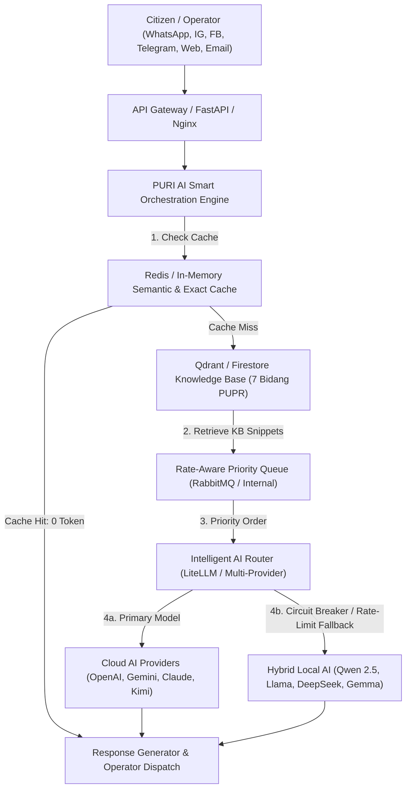

# 🤖 PURI AI Smart Orchestration & Optimization Engine
## Pelayanan Umum Responsif dan Informatif (PURI) - Dinas PUPR Kabupaten Garut

> **Spesifikasi Teknis & Arsitektur AI Gateway Resmi**  
> Strategi utama PURI AI Gateway **bukan membuat sistem "anti-limit" dengan cara menghindari pembatasan penyedia** (yang bertentangan dengan Terms of Service), melainkan membangun **AI Orchestration & Optimization Engine** untuk mencapai **AI Efficiency Rate** tertinggi. Dengan demikian, pemanfaatan Free Tier dan resource cloud menjadi sangat hemat, cepat, dan ketika satu layanan mencapai batas penggunaan, sistem beralih secara otomatis dan legal ke model lain atau model lokal.

---

## 🏛️ Arsitektur PURI AI Gateway (22-Point Enterprise Stack)



---

## 1. AI Router & 2. RAG First Strategy
Semua permintaan publik **tidak langsung dikirim ke AI**. Urutan eksekusi:
1. **Cache Engine (Redis / In-Memory)**: Pengecekan Exact & Semantic Cache (< 10ms, 0 Token).
2. **Knowledge Base / FAQ (Qdrant / Firestore)**: Retrieval dokumen resmi untuk 7 Bidang PUPR Garut.
3. **Perlu AI?**: Jika dokumen FAQ sudah lengkap, jawaban disusun tanpa pemanggilan model LLM berulang.
4. **Intelligent Model Routing**: Memilih model paling optimal sesuai tugas.

---

## 3. Intelligent Model Routing Table

| Jenis Permintaan | Model Utama | Cadangan | Alasan Pemilihan |
| :--- | :--- | :--- | :--- |
| **FAQ** | Knowledge Base | - | Jawaban instan 0 token dari FAQ resmi |
| **Persyaratan layanan** | Knowledge Base | ChatGPT | Akurasi administratif & kejelasan |
| **Percakapan umum** | ChatGPT | Gemini | Kecepatan respons & kualitas percakapan |
| **Dokumen panjang** | Gemini (128k/2M) | Claude | Konteks sangat panjang & analisis dokumen |
| **Analisis regulasi** | Claude | ChatGPT | Pemahaman regulasi, Perda, & pasal hukum |
| **Coding / Teknis** | Kimi | DeepSeek / OpenAI | Pemrosesan script, GIS, & koordinat JSON |
| **OCR** | PaddleOCR | Tesseract | Ekstraksi teks cepat dan lokal |
| **Foto bangunan (PBG/SLF)** | Gemini | ChatGPT | Kemampuan vision bangunan dan teknis |
| **Foto jalan (Bina Marga)** | Vision Model | Qwen VL | Deteksi kerusakan jalan & jembatan |
| **Ringkasan / Laporan** | Claude | ChatGPT | Struktur notulensi dan laporan rapat |
| **Terjemahan (Sunda/EN)** | ChatGPT | Gemini | Akurasi bahasa lokal & idiom |

---

## 4. AI Cache Engine & 5. Semantic Cache
- **0 Token Request**: Pertanyaan umum seperti *"Apa syarat PBG?"* disimpan di cache.
- **Semantic Cache Matching (Jaccard & Canonical Topic)**: Pertanyaan bertema sama dipetakan ke jawaban yang sama:
  - *"Apa syarat PBG?"*
  - *"Persyaratan PBG"*
  - *"Dokumen PBG"*
  - *"Syarat membuat PBG"*
  - *"bagaimana cara mengurus pbg"*
  Semua diarahkan ke satu cache entry secara otomatis.

---

## 6. Hybrid Local AI (Zero Cloud Dependency)
Untuk tugas berulang atau saat cloud provider mengalami rate limit / gangguan jaringan, sistem memanggil model lokal di server:
- **Qwen 2.5:7b**
- **Llama 3**
- **DeepSeek**
- **Gemma**

---

## 7. AI Health Monitor & 20. Fallback Policy
Sistem memantau status secara real-time:
```text
ChatGPT 🟢 | Gemini 🟢 | Claude 🟢 | Kimi 🟡 | Qwen Lokal 🟢
```
- **Rate-Limit / Quota Fallback**:
  ```text
  ChatGPT → Rate limit → Gemini → Rate limit → Claude → Rate limit → Kimi → Rate limit → Qwen Lokal
  ```
- Tidak mencoba "melewati" batas penyedia, melainkan **berpindah secara mulus** ke layanan lain yang tersedia sesuai ketentuan layanan.

---

## 8. Rate-Aware Queue (4-Tier Priority)
Semua request masuk ke antrean berdasarkan prioritas:
1. **Pengaduan Darurat** (`CRITICAL_EMERGENCY`: Jalan putus, jembatan ambruk, banjir kritis) → **Priority 1**
2. **Operator** (`OPERATOR`: Instruksi internal dinas) → **Priority 2**
3. **Masyarakat** (`CITIZEN`: Permohonan publik & pertanyaan) → **Priority 3**
4. **Analitik** (`ANALYTICS`: Ringkasan & klasifikasi batch) → **Priority 4**

---

## 9. Confidence Engine & 10. AI Consensus
- **Confidence ≥ 95%**: Jawaban langsung dikirimkan ke publik (`AUTO_ASSIGNED`).
- **Confidence < 95%**: Ditandai untuk validasi **Supervisor/Operator** sebelum dijawab.
- **AI Consensus**: Untuk pertanyaan hukum/regulasi penting, sistem membandingkan jawaban dari multiple model sebelum menghasilkan kesimpulan.

---

## 11. Token Optimization, 12. Smart Chunking & 13. Prompt Optimization
- **Smart Chunking**: Dokumen besar dipotong per pasal/bab sebelum di-embed ke Qdrant.
- **Token Optimization**: AI hanya membaca 2-3 halaman yang relevan, bukan seluruh 500 halaman dokumen.
- **Modular Prompting**: System Prompt disusun secara dinamis:
  ```text
  System Prompt + Relevant Knowledge Snippets + Conversation Memory + Question
  ```

---

## 14. AI Session Memory, 15. AI Scheduler & 16. Background Worker
- **Session Memory**: Konteks percakapan dipertahankan per session ID tanpa re-transmisi redundan.
- **Scheduler & Background Worker**: Tugas berat (analitik mingguan, re-embedding dokumen, ringkasan) dikerjakan secara background menggunakan **Local AI** saat jam non-sibuk.

---

## 17. Duplicate Detection & 18. Knowledge Refresh
- **Duplicate Detection**: Jika 100 warga menanyakan hal serupa (*"Bagaimana mengurus SLF?"*), sistem mendeteksi kesamaan dan menjawab menggunakan satu cache hasil komputasi awal.
- **Knowledge Refresh**: Dokumen peraturan baru (Perbup/Perda) cukup diunggah sekali ke Qdrant/Firestore dan langsung tersedia tanpa fine-tuning model LLM.

---

## 19. Dynamic Model Selection & 21. AI Usage Analytics
Dashboard secara otomatis menghitung dan melacak:
- `totalRequests`, `totalCacheHits`, `totalCacheMisses`
- **AI Efficiency Rate (%)** = `(Cache Hits + Local Requests) / Total Requests`
- **Fallback Rate (%)** & **Average Latency (ms)**
- Ketersediaan model (Circuit Breaker status & Cooldown timer).

---

## 22. Open Source Stack Rekomendasi
| Komponen | Teknologi |
| :--- | :--- |
| **AI Gateway** | LiteLLM |
| **Workflow** | LangGraph |
| **AI Framework** | LangChain |
| **API Gateway** | FastAPI / Next.js API Routes |
| **Cache** | Redis / In-Memory Semantic Cache |
| **Vector Database** | Qdrant / Supabase pgvector |
| **Queue** | RabbitMQ / In-Memory Priority Queue |
| **Storage** | MinIO / Cloud Storage |
| **Monitoring** | Prometheus + Grafana / GPS-CC Dashboard |
| **Reverse Proxy** | Nginx |
| **Local LLM** | Ollama / vLLM (Qwen, Llama, DeepSeek) |
| **OCR** | PaddleOCR |
| **Speech to Text** | Whisper |
