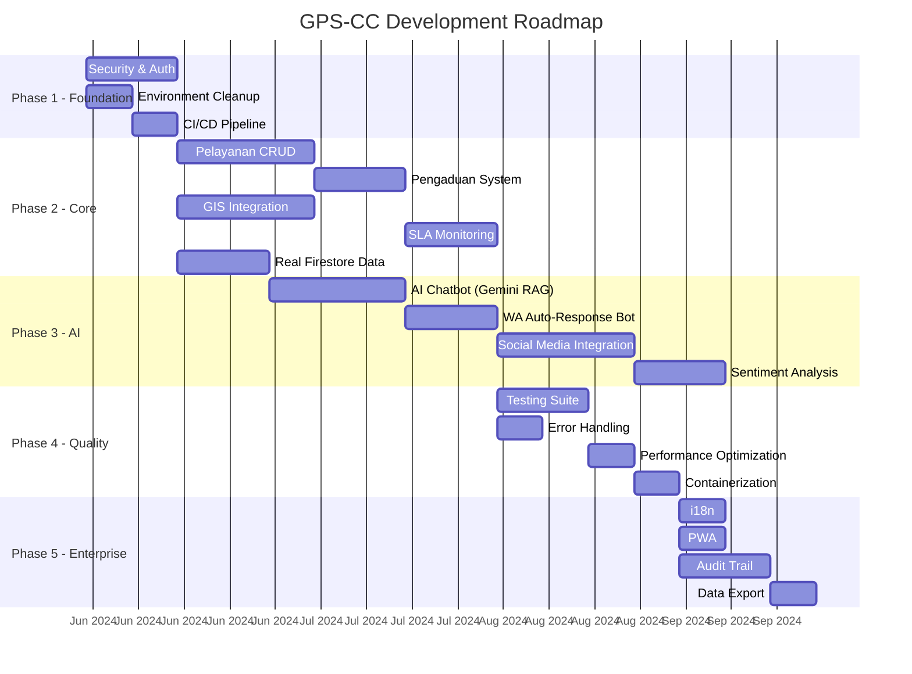

# 🗺️ Development Roadmap
## GPS-CC: Garut Public Service AI Command Center

---

## Timeline Overview

---

## Phase 1: Foundation & Security 🔒
**Durasi:** Sprint 1-2 (2 minggu)

### Sprint 1 (Minggu 1)
| # | Task | Status | Assignee |
|---|------|--------|----------|
| 1.1 | Migrasi kredensial ke environment variables | ✅ Done | - |
| 1.2 | Perbaiki Firestore security rules | ✅ Done | - |
| 1.3 | Implementasi CORS whitelist | ✅ Done | - |
| 1.4 | Perbaiki build script (Windows compat) | ✅ Done | - |
| 1.5 | Aktifkan ESLint pada build | ✅ Done | - |
| 1.6 | Setup project documentation (9 docs) | ✅ Done | - |
| 1.7 | Setup AGENTS.md (coding standards) | ✅ Done | - |
| 1.8 | `npm audit fix` (safe fixes) | 🔄 In Progress | - |

### Sprint 2 (Minggu 2)
| # | Task | Status | Assignee |
|---|------|--------|----------|
| 2.1 | Implementasi Firebase Auth (login/register) | ⬜ TODO | - |
| 2.2 | RBAC middleware pada API routes | ⬜ TODO | - |
| 2.3 | Login page UI | ⬜ TODO | - |
| 2.4 | Protected routes (client-side) | ⬜ TODO | - |
| 2.5 | Error boundaries (error.tsx, global-error.tsx) | ⬜ TODO | - |
| 2.6 | Setup CI/CD (GitHub Actions) | ⬜ TODO | - |
| 2.7 | Dockerfile + docker-compose | ⬜ TODO | - |

---

## Phase 2: Core Features 🏗️
**Durasi:** Sprint 3-6 (4 minggu)

### Sprint 3 (Minggu 3-4): Data & Pelayanan
| # | Task | Prioritas |
|---|------|-----------|
| 3.1 | Migrasi apiService dari mock ke Firestore | P0 |
| 3.2 | Dashboard real-time data binding | P0 |
| 3.3 | Pelayanan module: list permohonan | P0 |
| 3.4 | Pelayanan module: form pengajuan baru | P0 |
| 3.5 | Pelayanan module: upload dokumen | P0 |
| 3.6 | Pelayanan module: tracking status | P0 |
| 3.7 | Notifikasi WhatsApp otomatis | P1 |

### Sprint 4 (Minggu 5): Pengaduan & SLA
| # | Task | Prioritas |
|---|------|-----------|
| 4.1 | Pengaduan module: form submission | P0 |
| 4.2 | Pengaduan module: workflow tiket | P0 |
| 4.3 | Pengaduan module: assignment & eskalasi | P1 |
| 4.4 | SLA monitoring dashboard | P1 |
| 4.5 | SLA alert system | P1 |

### Sprint 5-6 (Minggu 6-7): GIS & Analytics
| # | Task | Prioritas |
|---|------|-----------|
| 5.1 | GIS module: peta interaktif Leaflet | P1 |
| 5.2 | GIS module: marker real-time | P1 |
| 5.3 | GIS module: heatmap per kecamatan | P2 |
| 5.4 | Analytics module: chart interaktif | P1 |
| 5.5 | Analytics module: export data | P2 |
| 5.6 | Pegawai module: operator management | P2 |
| 5.7 | Knowledge base: upload & search | P2 |

---

## Phase 3: AI & Automation 🤖
**Durasi:** Sprint 7-9 (3 minggu)

### Sprint 7 (Minggu 8-9): AI Core
| # | Task | Prioritas |
|---|------|-----------|
| 7.1 | AI chatbot page (Gemini integration) | P0 |
| 7.2 | RAG pipeline: Knowledge Base → Gemini | P0 |
| 7.3 | Context-aware prompting (layanan PUPR) | P1 |
| 7.4 | AI confidence scoring & handoff threshold | P1 |

### Sprint 8 (Minggu 10): WhatsApp Bot
| # | Task | Prioritas |
|---|------|-----------|
| 8.1 | Auto-reply bot: greeting & menu | P0 |
| 8.2 | Auto-reply bot: FAQ dari KB | P0 |
| 8.3 | Auto-reply bot: cek status permohonan | P1 |
| 8.4 | Auto-reply bot: pengaduan via chat | P1 |
| 8.5 | Eskalasi otomatis ke operator | P1 |

### Sprint 9 (Minggu 11): Social Media
| # | Task | Prioritas |
|---|------|-----------|
| 9.1 | Social media API integration (real) | P1 |
| 9.2 | Real-time sentiment analysis (AI) | P1 |
| 9.3 | Auto-alert untuk mention negatif viral | P2 |
| 9.4 | AI-assisted social reply | P2 |

---

## Phase 4: Quality & Operations 📊
**Durasi:** Sprint 10-12 (3 minggu)

| # | Task | Prioritas |
|---|------|-----------|
| 10.1 | Setup Vitest + testing utilities | P0 |
| 10.2 | Unit tests: hooks & services (80% coverage) | P0 |
| 10.3 | Integration tests: API routes | P1 |
| 10.4 | E2E tests: Playwright (critical flows) | P1 |
| 10.5 | Error monitoring: Sentry integration | P0 |
| 10.6 | Structured logging (replace console.log) | P1 |
| 10.7 | Performance audit & optimization | P1 |
| 10.8 | Lighthouse score ≥ 90 | P1 |
| 10.9 | Accessibility audit (WCAG 2.1 AA) | P1 |
| 10.10 | Docker production build | P1 |

---

## Phase 5: Enterprise & Scale 🏢
**Durasi:** Sprint 13+ (ongoing)

| # | Task | Prioritas |
|---|------|-----------|
| 13.1 | Internationalization (i18n: ID + EN) | P2 |
| 13.2 | PWA manifest + service worker | P2 |
| 13.3 | Audit trail system | P1 |
| 13.4 | Data export (PDF, Excel, CSV) | P1 |
| 13.5 | Multi-tenant support | P3 |
| 13.6 | API rate limiting | P1 |
| 13.7 | Backup & disaster recovery | P1 |
| 13.8 | Load testing (100 concurrent users) | P1 |

---

## Version Release Plan

| Version | Phase | Target | Key Deliverables |
|---------|-------|--------|------------------|
| **v0.1.0** | - | ✅ Current | Dashboard UI, WhatsApp Center, Social UI |
| **v0.2.0** | Phase 1 | Sprint 2 | Auth, RBAC, Security hardening |
| **v0.5.0** | Phase 2 | Sprint 6 | Pelayanan, Pengaduan, GIS, SLA |
| **v0.8.0** | Phase 3 | Sprint 9 | AI Bot, Auto-reply, Social integration |
| **v1.0.0** | Phase 4 | Sprint 12 | Full testing, production-ready |
| **v1.5.0** | Phase 5 | Sprint 15+ | i18n, PWA, enterprise features |

---

## Definition of Done (DoD)

Sebuah task dianggap **DONE** jika:

- [ ] Kode sudah di-review (PR approved)
- [ ] TypeScript build tanpa error
- [ ] ESLint tanpa error/warning
- [ ] Unit test ditulis dan passing
- [ ] Dokumentasi API/komponen di-update
- [ ] Tidak ada regresi di test lain
- [ ] UI responsive di mobile, tablet, desktop
- [ ] Accessible (keyboard navigable, screen reader friendly)
