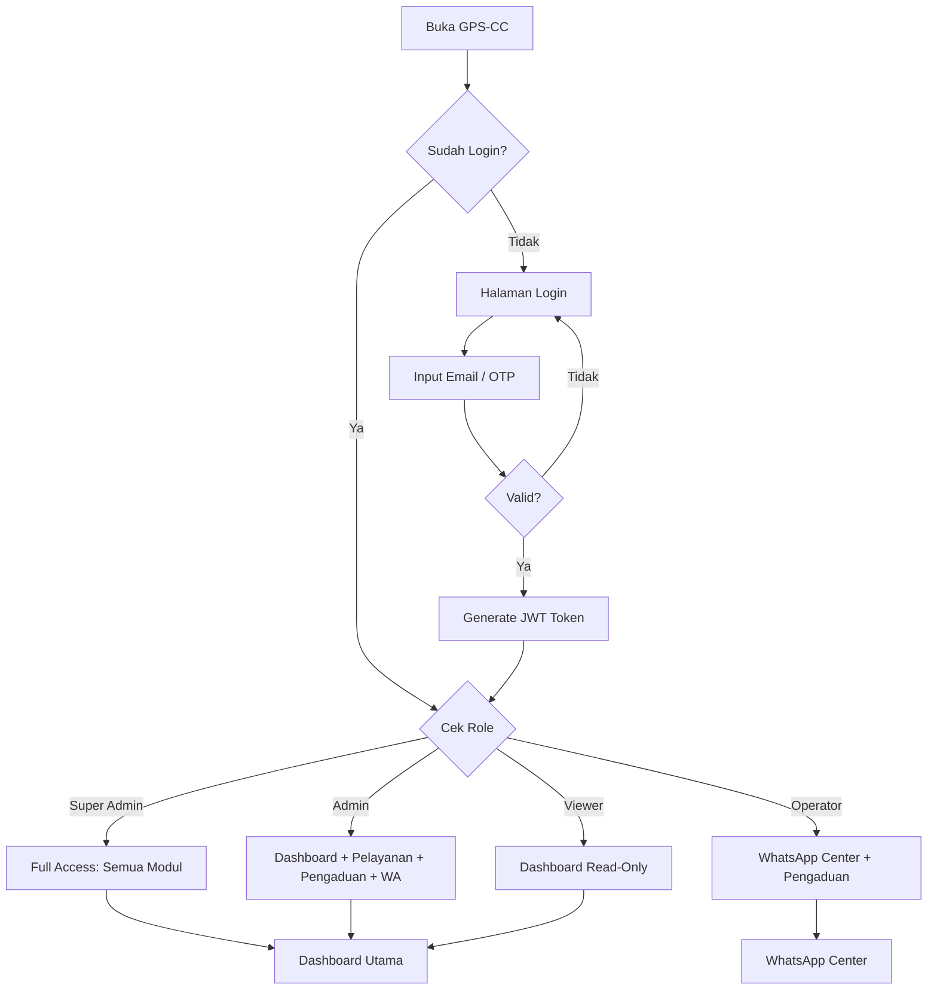
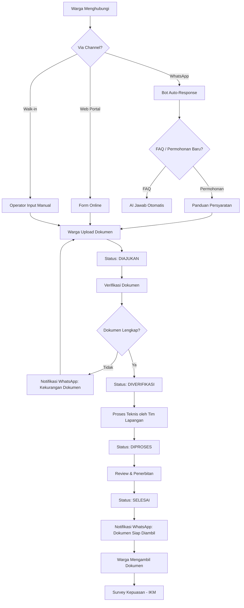
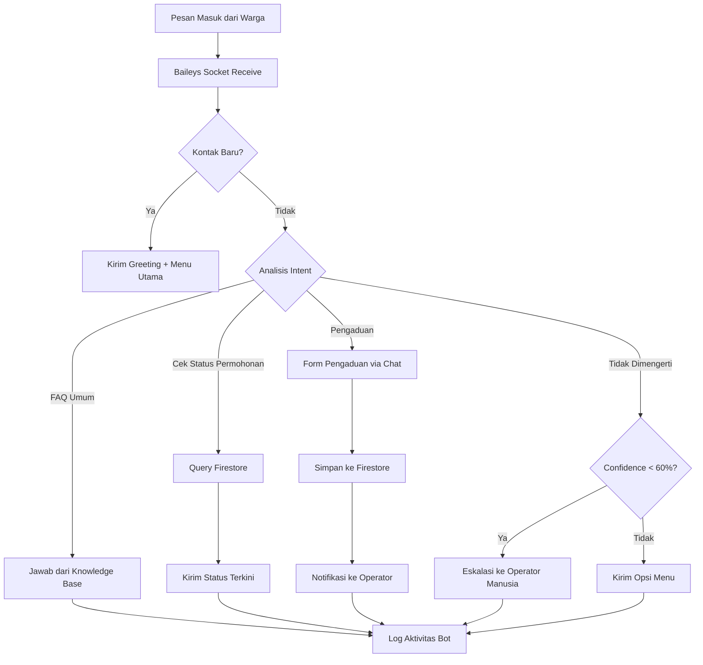
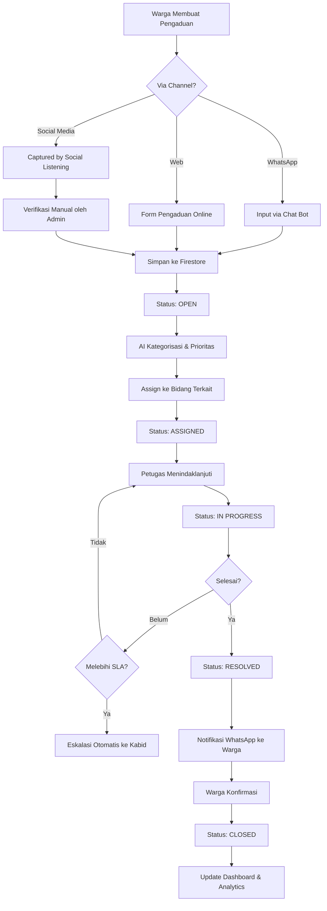
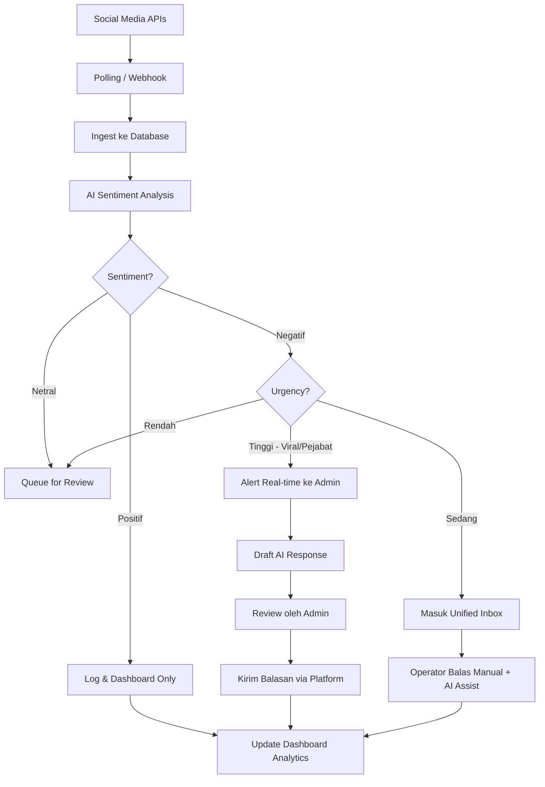
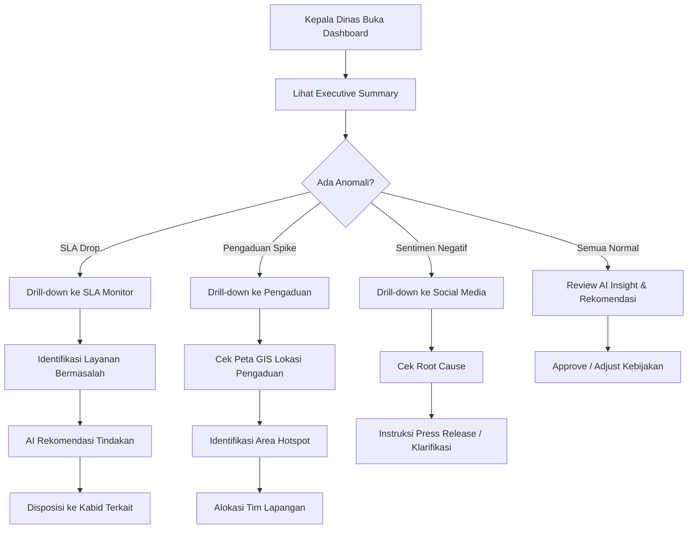

# 🔄 User Flow Diagrams
## GPS-CC: Garut Public Service AI Command Center

---

## 1. Flow Autentikasi & Akses

---

## 2. Flow Permohonan Layanan (Warga → Dinas)

---

## 3. Flow WhatsApp Auto-Response

---

## 4. Flow Pengaduan Warga

---

## 5. Flow Social Media Monitoring

---

## 6. Flow Eksekutif Decision Support

